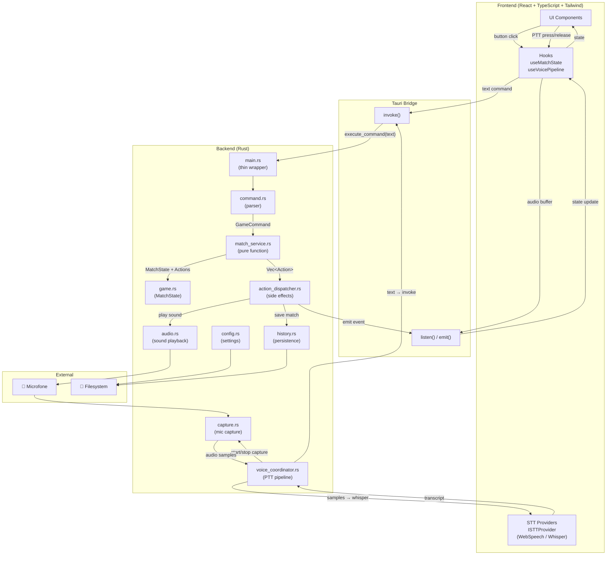
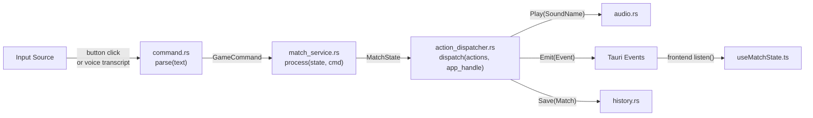
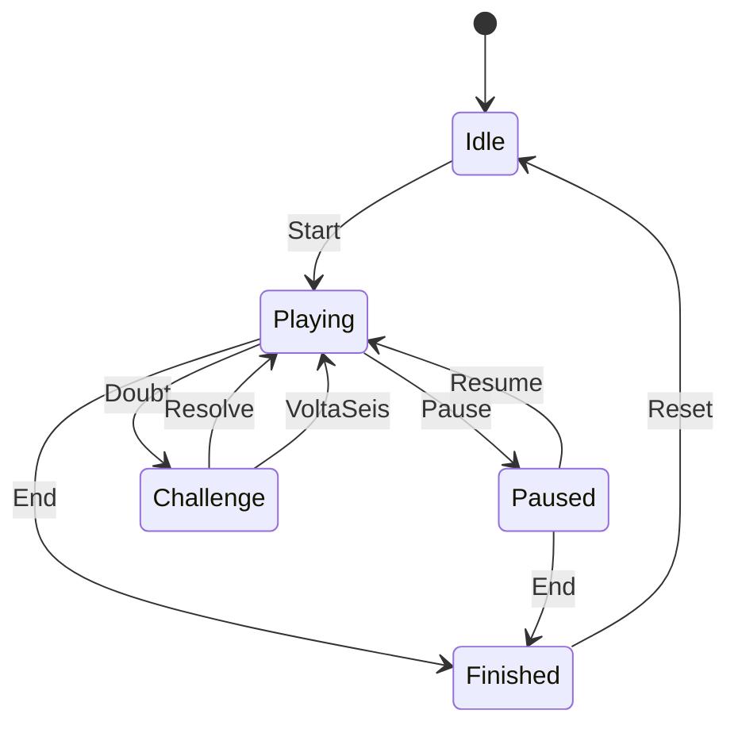

# E-Soccer Battle V3 — Arquitetura Completa (Do Zero)

> **Versão:** 3.0.0  
> **Data:** 2026-03-27  
> **Autor:** Arquiteto Agent 🏛️  
> **Status:** FINAL — Pronto para implementação

---

## Sumário

1. [Visão Geral](#1-visão-geral)
2. [Módulos Rust (Backend)](#2-módulos-rust-backend)
3. [Módulos TypeScript (Frontend)](#3-módulos-typescript-frontend)
4. [Contratos de Interface](#4-contratos-de-interface)
5. [ADRs](#5-adrs-architecture-decision-records)
6. [Tabela de Arquivos](#6-tabela-de-arquivos)
7. [Plano de Implementação (DAG)](#7-plano-de-implementação-dag)

---

## 1. Visão Geral

### 1.1 Diagrama de Arquitetura



### 1.2 Fluxo Unificado: Input → Parse → Process → Actions → Output



**Princípio-chave:** Voice e UI convergem no MESMO ponto — `parse(text)` — e seguem o MESMO caminho até o final. Zero duplicação.

### 1.3 Máquina de Estados



---

## 2. Módulos Rust (Backend)

### Estrutura de diretórios

```
src-tauri/src/
├── main.rs
├── game.rs
├── command.rs
├── match_service.rs
├── action_dispatcher.rs
├── voice_coordinator.rs
├── capture.rs
├── audio.rs
├── config.rs
└── history.rs
```

---

### 2.1 `game.rs` — Estado da Partida

**Responsabilidade ÚNICA:** Definir e gerenciar a estrutura de dados imutável que representa o estado completo de uma partida.

```rust
use serde::{Serialize, Deserialize};
use std::time::Duration;

/// Fase da partida (máquina de estados)
#[derive(Debug, Clone, Serialize, Deserialize, PartialEq)]
#[serde(rename_all = "snake_case")]
pub enum GamePhase {
    Idle,
    Playing,
    Paused,
    Finished,
}

/// Sub-estado ativo durante Playing
#[derive(Debug, Clone, Serialize, Deserialize, PartialEq)]
#[serde(rename_all = "snake_case")]
pub enum PlayingSubPhase {
    Normal,
    Challenge,
}

/// Configuração da partida (imutável após início)
#[derive(Debug, Clone, Serialize, Deserialize)]
pub struct MatchConfig {
    pub team_a_name: String,
    pub team_b_name: String,
    pub duration_secs: u64,
    pub timer_mode: TimerMode,
}

#[derive(Debug, Clone, Serialize, Deserialize, PartialEq)]
#[serde(rename_all = "snake_case")]
pub enum TimerMode {
    Countdown,
    CountUp,
}

/// Estado completo e imutável da partida
#[derive(Debug, Clone, Serialize, Deserialize)]
pub struct MatchState {
    pub phase: GamePhase,
    pub sub_phase: PlayingSubPhase,
    pub config: MatchConfig,
    pub score_a: u32,
    pub score_b: u32,
    pub elapsed_secs: u64,
    pub started_at: Option<u64>,      // timestamp millis
    pub paused_elapsed_secs: u64,     // acumulado quando pausado
    pub match_id: String,             // UUID
}

impl MatchState {
    /// Cria estado inicial Idle
    pub fn new(config: MatchConfig) -> Self;
    
    /// Retorna duração restante (countdown) ou decorrida (countup)
    pub fn display_time(&self) -> Duration;
    
    /// Retorna true se a partida acabou por tempo
    pub fn is_time_up(&self) -> bool;
    
    /// Deep clone com alterações (builder pattern imutável)
    pub fn with_score_a(self, score: u32) -> Self;
    pub fn with_score_b(self, score: u32) -> Self;
    pub fn with_phase(self, phase: GamePhase) -> Self;
    pub fn with_sub_phase(self, sub: PlayingSubPhase) -> Self;
    pub fn with_elapsed(self, elapsed: u64) -> Self;
}
```

**Depende de:** Nenhum módulo interno (puro domain).

**Dependências NÃO permitidas:** `tauri`, `cpal`, `rodio`.

**Linhas estimadas:** ~120

---

### 2.2 `command.rs` — Parser de Comandos

**Responsabilidade ÚNICA:** Converter texto livre em `GameCommand` enumerado.

```rust
use serde::{Serialize, Deserialize};

/// Comandos possíveis (OCP: adicionar = adicionar variante)
#[derive(Debug, Clone, Serialize, Deserialize, PartialEq)]
#[serde(rename_all = "snake_case")]
pub enum GameCommand {
    Start,
    GoalA,
    GoalB,
    Pause,
    Resume,
    End,
    Doubt,          // "dúvida" / "challenge"
    Resolve,
    VoltaSeis,      // "volta seis" / "6 metros"
    Reset,
}

/// Erro de parsing
#[derive(Debug, Clone, Serialize)]
pub struct ParseError {
    pub input: String,
    pub reason: String,
}

/// Parseia texto livre em GameCommand
/// Aceita variações: "gol a", "gol time a", "goal a", "goool a"
pub fn parse(input: &str) -> Result<GameCommand, ParseError>;

/// Lista de comandos disponíveis com aliases (para help page)
pub fn available_commands() -> Vec<CommandHelp>;

#[derive(Debug, Clone, Serialize)]
pub struct CommandHelp {
    pub command: String,
    pub description: String,
    pub aliases: Vec<String>,
}
```

**Algoritmo de `parse`:**
1. Normaliza: lowercase, trim, remove acentos
2. Matching por palavras-chave (tabela de aliases)
3. Prioridade: mais específico primeiro (ex: "volta seis" antes de "seis")
4. Fallback: erro com lista de comandos próximos

**Depende de:** Nenhum módulo interno.

**Dependências NÃO permitidas:** `tauri`, `cpal`.

**Linhas estimadas:** ~150

---

### 2.3 `match_service.rs` — Lógica de Negócio (PURO)

**Responsabilidade ÚNICA:** Receber estado + comando, retornar novo estado + lista de ações. ZERO efeitos colaterais. ZERO dependência Tauri.

```rust
use crate::game::{MatchState, GamePhase, PlayingSubPhase};
use crate::command::GameCommand;

/// Ações a serem executadas pelo dispatcher (não executadas aqui)
#[derive(Debug, Clone)]
pub enum Action {
    PlaySound(SoundName),
    EmitPhaseChanged(GamePhase),
    EmitScoreChanged { score_a: u32, score_b: u32 },
    EmitTimeUpdated { elapsed_secs: u64, display: String },
    EmitMatchFinished { score_a: u32, score_b: u32 },
    SaveMatch(MatchSnapshot),
    StartTimer,
    StopTimer,
    NoOp,
}

#[derive(Debug, Clone)]
pub enum SoundName {
    Goal,
    Whistle,
    SixMeters,
    Challenge,
}

/// Resultado do processamento de um comando
#[derive(Debug, Clone)]
pub struct MatchResult {
    pub new_state: MatchState,
    pub actions: Vec<Action>,
}

/// Snapshot para salvar no histórico
#[derive(Debug, Clone, serde::Serialize, serde::Deserialize)]
pub struct MatchSnapshot {
    pub match_id: String,
    pub team_a_name: String,
    pub team_b_name: String,
    pub score_a: u32,
    pub score_b: u32,
    pub duration_secs: u64,
    pub finished_at: String,  // ISO 8601
}

/// Processa um comando puro. NÃO executa efeitos colaterais.
/// Esta é a ÚNICA função pública deste módulo.
pub fn process(state: &MatchState, command: GameCommand) -> MatchResult;
```

**Lógica de `process`:**

| Command | Phase Permitida | Novo State | Ações |
|---------|----------------|------------|-------|
| Start | Idle | Playing, sub=Normal, started_at=now | StartTimer, PlaySound(Whistle), EmitPhaseChanged |
| GoalA | Playing (Normal) | score_a += 1 | PlaySound(Goal), EmitScoreChanged |
| GoalB | Playing (Normal) | score_b += 1 | PlaySound(Goal), EmitScoreChanged |
| Pause | Playing | Paused | StopTimer, EmitPhaseChanged |
| Resume | Paused | Playing, recalc elapsed | StartTimer, EmitPhaseChanged |
| Doubt | Playing (Normal) | sub=Challenge | PlaySound(Challenge), EmitPhaseChanged |
| Resolve | Playing (Challenge) | sub=Normal | EmitPhaseChanged |
| VoltaSeis | Playing (Challenge) | sub=Normal | PlaySound(SixMeters), EmitPhaseChanged |
| End | Playing/Paused | Finished | StopTimer, SaveMatch, PlaySound(Whistle), EmitMatchFinished |
| Reset | Finished | Idle (novo match_id) | EmitPhaseChanged |

**Qualquer comando em fase inválida** → `MatchResult { new_state: state.clone(), actions: vec![NoOp] }`

**Depende de:** `game`, `command`.

**Dependências NÃO permitidas:** `tauri`, `cpal`, `rodio`, `std::fs`.

**Linhas estimadas:** ~180

---

### 2.4 `action_dispatcher.rs` — Executor de Ações

**Responsabilidade ÚNICA:** Receber lista de `Action` e executar cada uma (som, evento, persistência).

```rust
use tauri::{AppHandle, Emitter, Manager};
use crate::match_service::{Action, SoundName, MatchSnapshot};
use crate::audio;
use crate::history;
use crate::game::GamePhase;

/// Executa todas as ações em sequência
pub async fn dispatch(
    actions: Vec<Action>,
    app_handle: &AppHandle,
) -> Result<(), DispatchError>;

/// Executa uma única ação (privado)
async fn execute_action(action: Action, app_handle: &AppHandle) -> Result<(), DispatchError>;

/// Emite evento Tauri
fn emit_event(app_handle: &AppHandle, name: &str, payload: &impl serde::Serialize);

#[derive(Debug)]
pub enum DispatchError {
    Audio(String),
    History(String),
    Emit(String),
}
```

**Mapeamento Action → Execução:**

| Action | Execução |
|--------|----------|
| PlaySound(Goal) | `audio::play(SoundName::Goal).await` |
| PlaySound(Whistle) | `audio::play(SoundName::Whistle).await` |
| EmitPhaseChanged(p) | `app_handle.emit("phase-changed", p)` |
| EmitScoreChanged{..} | `app_handle.emit("score-changed", payload)` |
| EmitTimeUpdated{..} | `app_handle.emit("time-updated", payload)` |
| EmitMatchFinished{..} | `app_handle.emit("match-finished", payload)` |
| SaveMatch(snap) | `history::save(snap).await` |
| StartTimer | `app_handle.emit("timer-control", "start")` |
| StopTimer | `app_handle.emit("timer-control", "stop")` |
| NoOp | (skip) |

**Depende de:** `match_service`, `audio`, `history`, `game`.

**Dependências NÃO permitidas:** `command`, `match_service` (não chama process novamente).

**Linhas estimadas:** ~100

---

### 2.5 `voice_coordinator.rs` — Pipeline de Voz

**Responsabilidade ÚNICA:** Orquestrar o fluxo PTT: captura → transcrição → envio para command pipeline.

```rust
use std::sync::mpsc;
use tauri::{AppHandle, Emitter};

/// Canal de saída do pipeline de voz
pub enum VoiceEvent {
    TranscriptReady(String),
    Listening,
    Silence,
    Error(String),
}

/// Gerencia o pipeline de voz (PTT)
pub struct VoiceCoordinator {
    is_listening: bool,
    event_tx: mpsc::Sender<VoiceEvent>,
}

impl VoiceCoordinator {
    pub fn new(event_tx: mpsc::Sender<VoiceEvent>) -> Self;

    /// Início PTT: começa a capturar
    pub async fn start_listening(&mut self, app: &AppHandle) -> Result<(), VoiceError>;

    /// Fim PTT: para captura, transcreve, emite resultado
    pub async fn stop_listening(&mut self, app: &AppHandle) -> Result<(), VoiceError>;

    /// Verifica se está ouvindo
    pub fn is_listening(&self) -> bool;
}

#[derive(Debug)]
pub enum VoiceError {
    Capture(String),
    Transcription(String),
    NotListening,
}
```

**Fluxo:**
1. `start_listening()` → inicia `capture::start()`
2. `stop_listening()` → para captura, obtém buffer
3. Envia buffer para transcrição (via Tauri event → frontend WebSpeechProvider OU via whisper direto)
4. Recebe transcript → emite `VoiceEvent::TranscriptReady(text)`
5. Tauri command `execute_command(text)` recebe e segue fluxo normal

**Depende de:** `capture`.

**Dependências NÃO permitidas:** `match_service`, `command` (não parseia nem processa).

**Linhas estimadas:** ~130

---

### 2.6 `capture.rs` — Captura de Microfone

**Responsabilidade ÚNICA:** Capturar áudio do microfone usando cpal.

```rust
use cpal::traits::{DeviceTrait, HostTrait, StreamTrait};

/// Configuração de captura
pub struct CaptureConfig {
    pub device_name: Option<String>,  // None = default
    pub sample_rate: u32,             // default: 16000
    pub channels: u16,                // default: 1 (mono)
}

/// Buffer de áudio capturado
pub struct AudioBuffer {
    pub samples: Vec<f32>,
    pub sample_rate: u32,
    pub channels: u16,
}

/// Gerencia stream de captura
pub struct CaptureStream {
    stream: cpal::Stream,
    buffer: Arc<Mutex<Vec<f32>>>,
    is_active: Arc<AtomicBool>,
}

impl CaptureStream {
    /// Inicia captura do dispositivo
    pub fn start(config: CaptureConfig) -> Result<Self, CaptureError>;

    /// Para captura e retorna buffer acumulado
    pub fn stop(self) -> Result<AudioBuffer, CaptureError>;

    /// Lista dispositivos de entrada disponíveis
    pub fn list_devices() -> Result<Vec<String>, CaptureError>;
}

#[derive(Debug)]
pub enum CaptureError {
    NoDevice,
    DeviceNotFound(String),
    StreamError(String),
    ConfigError(String),
}
```

**Depende de:** Nenhum módulo interno.

**Dependências NÃO permitidas:** `tauri` (exceto para debug logging).

**Linhas estimadas:** ~140

---

### 2.7 `audio.rs` — Reprodução de Sons

**Responsabilidade ÚNICA:** Reproduzir arquivos de áudio (gol, apito, etc).

```rust
use std::path::PathBuf;

/// Nomes de sons disponíveis
pub enum SoundFile {
    Goal,
    Whistle,
    SixMeters,
    Challenge,
}

impl SoundFile {
    /// Path relativo dentro de assets/sounds/
    pub fn filename(&self) -> &'static str;
}

/// Reproduz um som (bloqueante por ~2s max, executar em tokio::spawn)
pub async fn play(sound: SoundFile) -> Result<(), AudioError>;

/// Pré-carrega sons na memória (chamar na inicialização)
pub fn preload_sounds(resource_path: PathBuf) -> Result<(), AudioError>;

/// Obtém volume atual
pub fn volume() -> f32;

/// Define volume (0.0 - 1.0)
pub fn set_volume(vol: f32);

#[derive(Debug)]
pub enum AudioError {
    FileNotFound(String),
    Playback(String),
    Load(String),
}
```

**Implementação:** Usa `rodio` para playback. Sons ficam em `src-tauri/sounds/` (bundled via tauri resource).

**Depende de:** Nenhum módulo interno.

**Dependências NÃO permitidas:** `tauri`, `match_service`.

**Linhas estimadas:** ~80

---

### 2.8 `config.rs` — Configurações Persistentes

**Responsabilidade ÚNICA:** Carregar/salvar configurações do app (JSON file).

```rust
use serde::{Serialize, Deserialize};

#[derive(Debug, Clone, Serialize, Deserialize)]
pub struct AppConfig {
    pub mic_device: Option<String>,
    pub whisper_model: WhisperModel,
    pub language: Language,
    pub voice_threshold: f32,
    pub team_a_name: String,
    pub team_b_name: String,
    pub theme: Theme,
    pub match_duration_secs: u64,
    pub timer_mode: TimerMode,
    pub volume: f32,
}

#[derive(Debug, Clone, Serialize, Deserialize, PartialEq)]
#[serde(rename_all = "lowercase")]
pub enum WhisperModel {
    Tiny,
    Base,
    Small,
}

#[derive(Debug, Clone, Serialize, Deserialize, PartialEq)]
#[serde(rename_all = "lowercase")]
pub enum Language {
    PtBr,
    En,
    Es,
}

#[derive(Debug, Clone, Serialize, Deserialize, PartialEq)]
#[serde(rename_all = "lowercase")]
pub enum Theme {
    Dark,
    Light,
}

#[derive(Debug, Clone, Serialize, Deserialize, PartialEq)]
#[serde(rename_all = "lowercase")]
pub enum TimerMode {
    Countdown,
    CountUp,
}

impl AppConfig {
    /// Carrega de arquivo (cria default se não existe)
    pub fn load() -> Result<Self, ConfigError>;

    /// Salva em arquivo
    pub fn save(&self) -> Result<(), ConfigError>;

    /// Retorna configuração padrão
    pub fn default() -> Self;
}

/// Path do arquivo de config
pub fn config_path() -> PathBuf;

#[derive(Debug)]
pub enum ConfigError {
    Io(String),
    Parse(String),
}
```

**Path:** `{APP_DATA_DIR}/esoccer-battle/config.json`

**Depende de:** Nenhum módulo interno.

**Dependências NÃO permitidas:** `tauri`, `match_service`.

**Linhas estimadas:** ~110

---

### 2.9 `history.rs` — Persistência de Histórico

**Responsabilidade ÚNICA:** Salvar e listar histórico de partidas (JSON file).

```rust
use crate::match_service::MatchSnapshot;
use serde::{Serialize, Deserialize};

/// Entrada no histórico
#[derive(Debug, Clone, Serialize, Deserialize)]
pub struct HistoryEntry {
    pub id: String,
    pub match_id: String,
    pub team_a_name: String,
    pub team_b_name: String,
    pub score_a: u32,
    pub score_b: u32,
    pub duration_secs: u64,
    pub finished_at: String,  // ISO 8601
}

/// Salva resultado de partida no histórico
pub async fn save(snapshot: MatchSnapshot) -> Result<(), HistoryError>;

/// Lista todas as partidas (mais recente primeiro)
pub async fn list(limit: Option<usize>) -> Result<Vec<HistoryEntry>, HistoryError>;

/// Remove partida do histórico
pub async fn remove(id: &str) -> Result<(), HistoryError>;

/// Limpa todo o histórico
pub async fn clear() -> Result<(), HistoryError>;

/// Path do arquivo de histórico
fn history_path() -> PathBuf;

#[derive(Debug)]
pub enum HistoryError {
    Io(String),
    Parse(String),
}
```

**Path:** `{APP_DATA_DIR}/esoccer-battle/history.json`

**Formato:** JSON array de `HistoryEntry`.

**Depende de:** `match_service` (usa `MatchSnapshot`).

**Dependências NÃO permitidas:** `tauri`, `match_service::process`.

**Linhas estimadas:** ~90

---

### 2.10 `main.rs` — Thin Wrapper (Tauri Commands)

**Responsabilidade ÚNICA:** Expor Tauri commands e gerenciar estado. ZERO lógica de negócio.

```rust
mod game;
mod command;
mod match_service;
mod action_dispatcher;
mod voice_coordinator;
mod capture;
mod audio;
mod history;
mod config;

use tauri::{AppHandle, Manager, State};
use std::sync::Mutex;
use game::MatchState;
use config::AppConfig;

/// Estado global gerenciado pelo Tauri
struct AppState {
    match_state: Mutex<MatchState>,
    config: Mutex<AppConfig>,
}

/// Tauri Commands — cada um = 3-5 linhas

#[tauri::command]
async fn execute_command(
    text: String,
    state: State<'_, AppState>,
    app: AppHandle,
) -> Result<serde_json::Value, String>;

#[tauri::command]
async fn start_listening(
    state: State<'_, AppState>,
    app: AppHandle,
) -> Result<(), String>;

#[tauri::command]
async fn stop_listening(
    state: State<'_, AppState>,
    app: AppHandle,
) -> Result<String, String>;

#[tauri::command]
async fn get_config(
    state: State<'_, AppState>,
) -> Result<AppConfig, String>;

#[tauri::command]
async fn update_config(
    new_config: AppConfig,
    state: State<'_, AppState>,
) -> Result<(), String>;

#[tauri::command]
async fn get_state(
    state: State<'_, AppState>,
) -> Result<MatchState, String>;

#[tauri::command]
async fn get_history(
    limit: Option<usize>,
) -> Result<Vec<history::HistoryEntry>, String>;

#[tauri::command]
async fn list_mic_devices() -> Result<Vec<String>, String>;

#[tauri::command]
async fn get_available_commands() -> Result<Vec<command::CommandHelp>, String>;

#[tauri::command]
async fn reset_match(
    state: State<'_, AppState>,
    app: AppHandle,
) -> Result<(), String>;

fn main() {
    tauri::Builder::default()
        .manage(AppState {
            match_state: Mutex::new(MatchState::new(config::AppConfig::default().into())),
            config: Mutex::new(config::AppConfig::default()),
        })
        .setup(|app| {
            audio::preload_sounds(app.path().resource_dir().unwrap_or_default()).ok();
            Ok(())
        })
        .invoke_handler(tauri::generate_handler![
            execute_command,
            start_listening,
            stop_listening,
            get_config,
            update_config,
            get_state,
            get_history,
            list_mic_devices,
            get_available_commands,
            reset_match,
        ])
        .run(tauri::generate_context!())
        .expect("error while running tauri application");
}
```

**Exemplo de implementação de `execute_command`:**
```rust
#[tauri::command]
async fn execute_command(
    text: String,
    state: State<'_, AppState>,
    app: AppHandle,
) -> Result<serde_json::Value, String> {
    let cmd = command::parse(&text).map_err(|e| e.reason)?;
    let current = state.match_state.lock().map_err(|e| e.to_string())?;
    let result = match_service::process(&current, cmd);
    action_dispatcher::dispatch(result.actions, &app).await.map_err(|e| format!("{:?}", e))?;
    *state.match_state.lock().map_err(|e| e.to_string())? = result.new_state.clone();
    Ok(serde_json::to_value(&result.new_state).unwrap_or_default())
}
```

**Depende de:** TODOS os outros módulos (é o ponto de entrada).

**Dependências NÃO permitidas:** Nenhuma — é o main.

**Linhas estimadas:** ~100

---

## 3. Módulos TypeScript (Frontend)

### Estrutura de diretórios

```
src/
├── types.ts
├── hooks/
│   ├── useMatchState.ts
│   └── useVoicePipeline.ts
├── services/
│   └── stt/
│       ├── ISTTProvider.ts
│       ├── WebSpeechProvider.ts
│       ├── WhisperProvider.ts
│       └── sttFactory.ts
├── components/
│   ├── match/
│   │   ├── Scoreboard.tsx
│   │   ├── Timer.tsx
│   │   ├── Controls.tsx
│   │   ├── VoiceIndicator.tsx
│   │   ├── CommandLog.tsx
│   │   └── MatchLayout.tsx
│   ├── layout/
│   │   ├── Sidebar.tsx
│   │   └── AppShell.tsx
│   └── ui/
│       ├── Button.tsx
│       └── ThemeToggle.tsx
├── pages/
│   ├── MatchPage.tsx
│   ├── SettingsPage.tsx
│   ├── HistoryPage.tsx
│   └── HelpPage.tsx
├── App.tsx
└── main.tsx
```

---

### 3.1 `src/types.ts` — Tipos Compartilhados

**Responsabilidade ÚNICA:** Definir todos os tipos TypeScript espelhando o backend.

```typescript
// --- Enums (espelho Rust) ---

export type GamePhase = 'idle' | 'playing' | 'paused' | 'finished';
export type PlayingSubPhase = 'normal' | 'challenge';
export type TimerMode = 'countdown' | 'countup';
export type WhisperModel = 'tiny' | 'base' | 'small';
export type Language = 'pt_br' | 'en' | 'es';
export type Theme = 'dark' | 'light';

// --- State ---

export interface MatchConfig {
  team_a_name: string;
  team_b_name: string;
  duration_secs: number;
  timer_mode: TimerMode;
}

export interface MatchState {
  phase: GamePhase;
  sub_phase: PlayingSubPhase;
  config: MatchConfig;
  score_a: number;
  score_b: number;
  elapsed_secs: number;
  started_at: number | null;
  paused_elapsed_secs: number;
  match_id: string;
}

export interface AppConfig {
  mic_device: string | null;
  whisper_model: WhisperModel;
  language: Language;
  voice_threshold: number;
  team_a_name: string;
  team_b_name: string;
  theme: Theme;
  match_duration_secs: number;
  timer_mode: TimerMode;
  volume: number;
}

// --- History ---

export interface HistoryEntry {
  id: string;
  match_id: string;
  team_a_name: string;
  team_b_name: string;
  score_a: number;
  score_b: number;
  duration_secs: number;
  finished_at: string;
}

// --- Command Help ---

export interface CommandHelp {
  command: string;
  description: string;
  aliases: string[];
}

// --- Voice ---

export type VoiceStatus = 'idle' | 'listening' | 'processing' | 'error';

export interface VoiceEvent {
  status: VoiceStatus;
  transcript?: string;
  error?: string;
}

// --- Tauri Event Payloads ---

export interface ScoreChangedPayload {
  score_a: number;
  score_b: number;
}

export interface TimeUpdatedPayload {
  elapsed_secs: number;
  display: string;
}

export interface MatchFinishedPayload {
  score_a: number;
  score_b: number;
}
```

**Depende de:** Nenhum.

**Linhas estimadas:** ~100

---

### 3.2 `src/hooks/useMatchState.ts` — Estado da Partida

**Responsabilidade ÚNICA:** Sincronizar estado da partida via Tauri events + manter timer local.

```typescript
import { useState, useEffect, useCallback, useRef } from 'react';
import { listen, invoke } from '@tauri-apps/api/core';
import type { MatchState, AppConfig } from '../types';

interface UseMatchStateReturn {
  state: MatchState | null;
  config: AppConfig | null;
  isLoading: boolean;
  displayTime: string;
  executeCommand: (text: string) => Promise<void>;
  resetMatch: () => Promise<void>;
  loadConfig: () => Promise<void>;
  updateConfig: (config: AppConfig) => Promise<void>;
}

export function useMatchState(): UseMatchStateReturn;

// Internals:
// - On mount: invoke('get_state') + invoke('get_config') for initial state
// - Listen to events: 'score-changed', 'time-updated', 'phase-changed', 'match-finished'
// - Local timer via setInterval (1s) only when phase=playing
// - displayTime: computed from elapsed_secs + timer_mode + duration
```

**Depende de:** `types.ts`, `@tauri-apps/api/core`.

**Linhas estimadas:** ~120

---

### 3.3 `src/hooks/useVoicePipeline.ts` — Pipeline de Voz

**Responsabilidade ÚNICA:** Coordena PTT → STT provider → execute_command. **SEMPRE** usa ISTTProvider.

```typescript
import { useState, useCallback, useRef } from 'react';
import type { VoiceStatus, VoiceEvent } from '../types';
import type { ISTTProvider } from '../services/stt/ISTTProvider';

interface UseVoicePipelineReturn {
  voiceStatus: VoiceStatus;
  isListening: boolean;
  lastTranscript: string | null;
  lastError: string | null;
  startListening: () => Promise<void>;
  stopListening: () => Promise<void>;
  cancelListening: () => void;
  setProvider: (provider: ISTTProvider) => void;
}

interface UseVoicePipelineOptions {
  provider: ISTTProvider;  // Injetado via DIP (nunca importado direto)
  onTranscript: (text: string) => Promise<void>;
  onError?: (error: string) => void;
}

export function useVoicePipeline(options: UseVoicePipelineOptions): UseVoicePipelineReturn;

// Internals:
// - startListening(): invoca Tauri 'start_listening', depois chama provider.start()
// - stopListening(): provider.stop() → onTranscript(text) → execute_command flow
// - VoiceStatus transitions: idle → listening → processing → idle
// - Cleanup on unmount: cancel any active listening
```

**Depende de:** `types.ts`, `services/stt/ISTTProvider.ts`, `@tauri-apps/api/core`.

**NÃO depende de:** `WebSpeechProvider`, `WhisperProvider` (DIP!).

**Linhas estimadas:** ~90

---

### 3.4 `src/services/stt/ISTTProvider.ts` — Interface STT

**Responsabilidade ÚNICA:** Definir contrato para qualquer provedor STT.

```typescript
export interface ISTTProvider {
  /** Nome do provider (para debug/display) */
  readonly name: string;

  /** Inicia captura + transcrição */
  start(): Promise<void>;

  /** Para captura, retorna transcript */
  stop(): Promise<string>;

  /** Cancela sem transcrever */
  cancel(): void;

  /** Verifica se está disponível */
  isAvailable(): Promise<boolean>;

  /** Evento de status (opcional) */
  onStatusChange?: (status: 'idle' | 'listening' | 'processing') => void;
}
```

**Depende de:** Nenhum.

**Linhas estimadas:** ~20

---

### 3.5 `src/services/stt/WebSpeechProvider.ts` — Web Speech API

**Responsabilidade ÚNICA:** STT via browser Web Speech API.

```typescript
import type { ISTTProvider } from './ISTTProvider';

export class WebSpeechProvider implements ISTTProvider {
  readonly name = 'web-speech';
  
  private recognition: SpeechRecognition | null = null;
  private lang: string;

  constructor(lang: string = 'pt-BR');

  async start(): Promise<void>;
  async stop(): Promise<string>;
  cancel(): void;
  async isAvailable(): Promise<boolean>;
  
  onStatusChange?: (status: 'idle' | 'listening' | 'processing') => void;

  private createRecognition(): SpeechRecognition;
  private cleanup(): void;
}
```

**Depende de:** `ISTTProvider.ts`.

**Linhas estimadas:** ~80

---

### 3.6 `src/services/stt/WhisperProvider.ts` — Whisper via Tauri

**Responsabilidade ÚNICA:** STT via backend Whisper (audio capturado → Tauri → whisper-rs).

```typescript
import type { ISTTProvider } from './ISTTProvider';
import { invoke } from '@tauri-apps/api/core';

export class WhisperProvider implements ISTTProvider {
  readonly name = 'whisper';
  
  private model: string;
  private language: string;

  constructor(model: string = 'base', language: string = 'pt-BR');

  async start(): Promise<void>;
  async stop(): Promise<string>;
  cancel(): void;
  async isAvailable(): Promise<boolean>;

  onStatusChange?: (status: 'idle' | 'listening' | 'processing') => void;

  // start: invoke('start_listening')
  // stop: invoke('stop_listening') → returns transcript string
  // cancel: invoke cleanup
}
```

**Depende de:** `ISTTProvider.ts`, `@tauri-apps/api/core`.

**Linhas estimadas:** ~60

---

### 3.7 `src/services/stt/sttFactory.ts` — Factory

**Responsabilidade ÚNICA:** Criar ISTTProvider baseado na configuração.

```typescript
import type { ISTTProvider } from './ISTTProvider';
import { WebSpeechProvider } from './WebSpeechProvider';
import { WhisperProvider } from './WhisperProvider';
import type { AppConfig } from '../../types';

export type STTBackend = 'auto' | 'web-speech' | 'whisper';

export async function createSTTProvider(
  backend: STTBackend,
  config: AppConfig,
): Promise<ISTTProvider>;

// 'auto' → tenta WebSpeech primeiro, fallback Whisper
// Se web-speech não disponível → Whisper
```

**Depende de:** `ISTTProvider.ts`, `WebSpeechProvider.ts`, `WhisperProvider.ts`, `types.ts`.

**Linhas estimadas:** ~30

---

### 3.8 `src/components/match/Scoreboard.tsx`

```typescript
interface ScoreboardProps {
  teamAName: string;
  teamBName: string;
  scoreA: number;
  scoreB: number;
  phase: GamePhase;
  subPhase: PlayingSubPhase;
}
```

**Responsabilidade:** Exibir placar com nomes dos times e destaque no gol.  
**Depende de:** `types.ts`.  
**Linhas estimadas:** ~60

---

### 3.9 `src/components/match/Timer.tsx`

```typescript
interface TimerProps {
  displayTime: string;
  phase: GamePhase;
  timerMode: TimerMode;
  totalDuration: number; // em segundos, para progress bar
}
```

**Responsabilidade:** Exibir cronômetro com progress bar.  
**Depende de:** `types.ts`.  
**Linhas estimadas:** ~50

---

### 3.10 `src/components/match/Controls.tsx`

```typescript
interface ControlsProps {
  phase: GamePhase;
  subPhase: PlayingSubPhase;
  onExecuteCommand: (text: string) => Promise<void>;
}
```

**Responsabilidade:** Botões de ação (Iniciar, Pausar, Gol A/B, Dúvida, Resolver, Volta Seis, Encerrar). Botões habilitados/desabilitados baseado na fase.  
**Depende de:** `types.ts`, `ui/Button.tsx`.  
**Linhas estimadas:** ~90

---

### 3.11 `src/components/match/VoiceIndicator.tsx`

```typescript
interface VoiceIndicatorProps {
  status: VoiceStatus;
  lastTranscript: string | null;
  isListening: boolean;
  onStart: () => void;
  onStop: () => void;
}
```

**Responsabilidade:** Botão PTT grande + indicador visual (mic animado, transcript, status).  
**Depende de:** `types.ts`.  
**Linhas estimadas:** ~70

---

### 3.12 `src/components/match/CommandLog.tsx`

```typescript
interface CommandLogProps {
  entries: CommandLogEntry[];
}

interface CommandLogEntry {
  id: string;
  timestamp: Date;
  command: string;
  source: 'voice' | 'button';
  success: boolean;
}
```

**Responsabilidade:** Log scrollável de comandos executados.  
**Depende de:** Nenhum (usa tipos locais).  
**Linhas estimadas:** ~50

---

### 3.13 `src/components/match/MatchLayout.tsx`

```typescript
interface MatchLayoutProps {
  // Passa tudo via useMatchState + useVoicePipeline
}
```

**Responsabilidade:** Layout da página de partida. Orquestra Scoreboard, Timer, Controls, VoiceIndicator, CommandLog.  
**Depende de:** Todos os componentes match/*, hooks.  
**Linhas estimadas:** ~40

---

### 3.14 `src/pages/MatchPage.tsx`

**Responsabilidade:** Página principal. Usa `useMatchState` + `useVoicePipeline` + `MatchLayout`.  
**Depende de:** hooks, components/match/MatchLayout, services/stt/sttFactory.  
**Linhas estimadas:** ~50

---

### 3.15 `src/pages/SettingsPage.tsx`

**Responsabilidade:** Formulário de configurações. Lista de mics, modelo whisper, idioma, nomes, tema, volume, duração.  
**Depende de:** hooks/useMatchState (loadConfig, updateConfig), types.ts.  
**Linhas estimadas:** ~150

---

### 3.16 `src/pages/HistoryPage.tsx`

**Responsabilidade:** Tabela de partidas anteriores. Botão limpar histórico.  
**Depende de:** types.ts, @tauri-apps/api/core.  
**Linhas estimadas:** ~80

---

### 3.17 `src/pages/HelpPage.tsx`

**Responsabilidade:** Lista de comandos de voz com descrições e aliases.  
**Depende de:** types.ts, @tauri-apps/api/core.  
**Linhas estimadas:** ~60

---

## 4. Contratos de Interface

### 4.1 GameCommand → MatchService → MatchResult

```
Input:  (MatchState, GameCommand)
Output: MatchResult { new_state: MatchState, actions: Vec<Action> }

Garantias:
- Sem efeitos colaterais
- Determinístico (mesmo input = mesmo output)
- Thread-safe (não acessa estado global)
- Testável sem mock
```

### 4.2 ISTTProvider (TypeScript)

```typescript
interface ISTTProvider {
  readonly name: string;
  start(): Promise<void>;
  stop(): Promise<string>;
  cancel(): void;
  isAvailable(): Promise<boolean>;
  onStatusChange?: (status: 'idle' | 'listening' | 'processing') => void;
}
```

### 4.3 Tauri Events

| Event Name | Payload | Emissor | Consumidor |
|---|---|---|---|
| `phase-changed` | `{ phase: GamePhase, sub_phase: PlayingSubPhase }` | action_dispatcher | useMatchState |
| `score-changed` | `{ score_a: number, score_b: number }` | action_dispatcher | useMatchState |
| `time-updated` | `{ elapsed_secs: number, display: string }` | action_dispatcher | useMatchState |
| `match-finished` | `{ score_a: number, score_b: number }` | action_dispatcher | useMatchState |
| `timer-control` | `"start" \| "stop"` | action_dispatcher | useMatchState (local timer) |
| `voice-status` | `{ status: VoiceStatus, transcript?: string, error?: string }` | voice_coordinator | useVoicePipeline |

### 4.4 Tauri Commands

| Command | Parâmetros | Retorno | Descrição |
|---|---|---|---|
| `execute_command` | `text: String` | `MatchState (JSON)` | Parseia e executa comando |
| `start_listening` | _(none)_ | `()` | Inicia captura PTT |
| `stop_listening` | _(none)_ | `String` (transcript) | Para captura e transcreve |
| `get_config` | _(none)_ | `AppConfig` | Carrega configurações |
| `update_config` | `new_config: AppConfig` | `()` | Salva configurações |
| `get_state` | _(none)_ | `MatchState` | Estado atual da partida |
| `get_history` | `limit?: usize` | `Vec<HistoryEntry>` | Lista histórico |
| `list_mic_devices` | _(none)_ | `Vec<String>` | Dispositivos de áudio |
| `get_available_commands` | _(none)_ | `Vec<CommandHelp>` | Lista comandos de voz |
| `reset_match` | _(none)_ | `()` | Reseta para novo jogo |

---

## 5. ADRs (Architecture Decision Records)

### ADR-001: MatchService como Função Pura

**Status:** Aceito  
**Contexto:** Precisamos processar comandos e produzir mudanças de estado + ações.

**Decisão:** `match_service::process(state, cmd) → MatchResult` é uma função pura sem efeitos colaterais.

**Consequências:**
- ✅ Testável sem mock de Tauri, cpal, filesystem
- ✅ Determinística → fácil debug
- ✅ Separada de infraestrutura → pode rodar em WASM para testes frontend
- ✅ Adicionar novo comando = 1 arquivo (command.rs) + 1 match arm (match_service.rs)
- ⚠️ Exige dispatcher separado para executar ações

---

### ADR-002: Unificação Voice e UI

**Status:** Aceito  
**Contexto:** Bug histórico: voz e UI tinham caminhos diferentes, causando duplicação e bugs.

**Decisão:** Ambos convergem em `command::parse(text)`. Voice transcreve → texto → parse → process → dispatch. Botão → texto → parse → process → dispatch.

**Consequências:**
- ✅ Zero duplicação de lógica
- ✅ Voice pipeline SEMPRE conecta ao parser (bug fix)
- ✅ Novo comando funciona automaticamente em ambos
- ✅ Log unificado de comandos
- ⚠️ Voice precisa passar por mesmo fluxo (leve latência adicional, aceitável)

---

### ADR-003: ISTTProvider Interface (DIP)

**Status:** Aceito  
**Contexto:** Frontend precisa de STT mas não deve depender de implementação concreta.

**Decisão:** Interface `ISTTProvider` com factory. Frontend sempre referencia interface, nunca implementação.

**Consequências:**
- ✅ WebSpeech e Whisper intercambiáveis
- ✅ Testável com mock provider
- ✅ Adicionar novo provider = 1 arquivo
- ✅ Auto-detect: factory escolhe melhor disponível
- ⚠️ Factory tem dependência em ambas implementações (aceitável, é único ponto)

---

### ADR-004: Action Dispatcher Separado

**Status:** Aceito  
**Contexto:** MatchService é puro → não pode executar ações. Precisamos de somewhere to run effects.

**Decisão:** `action_dispatcher.rs` recebe `Vec<Action>` e executa cada uma. É o único módulo com efeitos colaterais.

**Consequências:**
- ✅ SRP: match_service = lógica, dispatcher = efeitos
- ✅ Dispatcher pode ser substituído (ex: logging dispatcher para testes)
- ✅ Ordem de ações é explícita e previsível
- ⚠️ Erro no dispatcher não afeta novo estado (state já foi calculado)

---

### ADR-005: State Management via Tauri Events

**Status:** Aceito  
**Contexto:** Frontend precisa saber o estado da partida. Opções: polling, Tauri events, React state local.

**Decisão:** Backend emite eventos Tauri (`phase-changed`, `score-changed`, etc). Frontend `useMatchState` escuta e atualiza React state local.

**Consequências:**
- ✅ Single source of truth = Rust backend
- ✅ Frontend é view-only (não duplica lógica de estado)
- ✅ Events são push-based → sem polling
- ✅ Fácil adicionar mais listeners
- ⚠️ Perda de eventos se frontend carregado durante emissão (mitigado por get_state command)

---

### ADR-006: Config como JSON File

**Status:** Aceito  
**Contexto:** Precisamos persistir configurações. Opções: SQLite, JSON file, Tauri store plugin.

**Decisão:** JSON file simples em `{APP_DATA_DIR}/esoccer-battle/config.json`.

**Consequências:**
- ✅ Zero dependência extra
- ✅ Leitura humana (debug fácil)
- ✅ Tamanho pequeno (~1KB) → performance irrelevante
- ⚠️ Sem migração automática (aceitável, raramente muda schema)

---

### ADR-007: Timer no Frontend

**Status:** Aceito  
**Contexto:** Timer precisa atualizar a cada segundo. Opções: backend timer thread, frontend setInterval.

**Decisão:** Backend emite `timer-control: "start"/"stop"`. Frontend roda `setInterval(1000)` local, incrementa `elapsed_secs`.

**Consequências:**
- ✅ Backend não precisa de thread de timer
- ✅ Timer respeita pausa/retomada naturalmente
- ✅ Display atualiza suavemente (60fps via CSS transitions no display, 1s no contador)
- ⚠️ Timer pode drift em sessions longas (aceitável para futebol society)

---

## 6. Tabela de Arquivos

| # | Arquivo | Tipo | Responsabilidade | Depende de | Linhas |
|---|---------|------|------------------|------------|--------|
| 1 | `src-tauri/src/game.rs` | Rust | Estado da partida (MatchState) | Nenhum | ~120 |
| 2 | `src-tauri/src/command.rs` | Rust | Parser de comandos | Nenhum | ~150 |
| 3 | `src-tauri/src/match_service.rs` | Rust | Lógica pura (process) | game, command | ~180 |
| 4 | `src-tauri/src/action_dispatcher.rs` | Rust | Executor de ações | match_service, audio, history, game | ~100 |
| 5 | `src-tauri/src/voice_coordinator.rs` | Rust | Pipeline de voz | capture | ~130 |
| 6 | `src-tauri/src/capture.rs` | Rust | Captura de microfone | Nenhum | ~140 |
| 7 | `src-tauri/src/audio.rs` | Rust | Reprodução de sons | Nenhum | ~80 |
| 8 | `src-tauri/src/config.rs` | Rust | Configurações persistentes | Nenhum | ~110 |
| 9 | `src-tauri/src/history.rs` | Rust | Persistência histórico | match_service (Snapshot) | ~90 |
| 10 | `src-tauri/src/main.rs` | Rust | Tauri commands (thin) | Todos | ~100 |
| 11 | `src/types.ts` | TS | Tipos compartilhados | Nenhum | ~100 |
| 12 | `src/hooks/useMatchState.ts` | TS | Estado partida + timer | types, tauri | ~120 |
| 13 | `src/hooks/useVoicePipeline.ts` | TS | Pipeline PTT + STT | types, ISTTProvider, tauri | ~90 |
| 14 | `src/services/stt/ISTTProvider.ts` | TS | Interface STT | Nenhum | ~20 |
| 15 | `src/services/stt/WebSpeechProvider.ts` | TS | Web Speech API impl | ISTTProvider | ~80 |
| 16 | `src/services/stt/WhisperProvider.ts` | TS | Whisper via Tauri impl | ISTTProvider, tauri | ~60 |
| 17 | `src/services/stt/sttFactory.ts` | TS | Factory de provider | ISTTProvider, WebSpeech, Whisper, types | ~30 |
| 18 | `src/components/match/Scoreboard.tsx` | TSX | Placar | types | ~60 |
| 19 | `src/components/match/Timer.tsx` | TSX | Cronômetro + progress | types | ~50 |
| 20 | `src/components/match/Controls.tsx` | TSX | Botões de ação | types, ui/Button | ~90 |
| 21 | `src/components/match/VoiceIndicator.tsx` | TSX | PTT button + status | types | ~70 |
| 22 | `src/components/match/CommandLog.tsx` | TSX | Log de comandos | Nenhum | ~50 |
| 23 | `src/components/match/MatchLayout.tsx` | TSX | Layout da partida | Todos match/* | ~40 |
| 24 | `src/components/layout/Sidebar.tsx` | TSX | Navegação lateral | Nenhum | ~30 |
| 25 | `src/components/layout/AppShell.tsx` | TSX | Shell da aplicação | Sidebar | ~20 |
| 26 | `src/components/ui/Button.tsx` | TSX | Botão reutilizável | Nenhum | ~30 |
| 27 | `src/components/ui/ThemeToggle.tsx` | TSX | Toggle dark/light | Nenhum | ~20 |
| 28 | `src/pages/MatchPage.tsx` | TSX | Página principal | hooks, MatchLayout, sttFactory | ~50 |
| 29 | `src/pages/SettingsPage.tsx` | TSX | Configurações | hooks, types | ~150 |
| 30 | `src/pages/HistoryPage.tsx` | TSX | Histórico de partidas | types, tauri | ~80 |
| 31 | `src/pages/HelpPage.tsx` | TSX | Ajuda (comandos) | types, tauri | ~60 |
| 32 | `src/App.tsx` | TSX | Router + layout | Pages, AppShell | ~30 |
| 33 | `src/main.tsx` | TSX | Entry point | App | ~10 |

**Total estimado: ~2,640 linhas**

---

## 7. Plano de Implementação (DAG)

```json
{
  "project": "esoccer-battle-v3",
  "adr": "ADR-001 to ADR-007",
  "stack": {
    "backend": "Tauri v2 + Rust (cpal, whisper-rs, rodio, serde)",
    "frontend": "React 18 + Vite + TypeScript + Tailwind CSS",
    "platform": "Windows (primário)"
  },
  "tasks": [
    {
      "id": "T01",
      "type": "scaffold",
      "agent": "builder",
      "description": "Criar projeto Tauri v2 + React + Vite + TS + Tailwind. Configurar Cargo.toml com dependências (cpal, rodio, serde, whisper-rs, tauri-plugin-shell)",
      "dependencies": []
    },
    {
      "id": "T02",
      "type": "implementation",
      "agent": "backend-agent",
      "description": "Implementar game.rs — MatchState, GamePhase, PlayingSubPhase, MatchConfig, TimerMode com todos os with_* builders e display_time",
      "dependencies": ["T01"]
    },
    {
      "id": "T02-TEST",
      "type": "test",
      "agent": "qa-tester",
      "description": "Testes unitários game.rs: new(), with_*, display_time, is_time_up, serialization",
      "dependencies": ["T02"]
    },
    {
      "id": "T03",
      "type": "implementation",
      "agent": "backend-agent",
      "description": "Implementar command.rs — GameCommand enum, parse() com normalização e matching de aliases, CommandHelp, available_commands()",
      "dependencies": ["T01"]
    },
    {
      "id": "T03-TEST",
      "type": "test",
      "agent": "qa-tester",
      "description": "Testes unitários command.rs: parse para todos comandos, variações (gol a, goal time b, volta seis, dúvida, challenge), ParseError",
      "dependencies": ["T03"]
    },
    {
      "id": "T04",
      "type": "implementation",
      "agent": "backend-agent",
      "description": "Implementar match_service.rs — Action enum, SoundName, MatchSnapshot, MatchResult, process() com tabela completa de transições",
      "dependencies": ["T02", "T03"]
    },
    {
      "id": "T04-TEST",
      "type": "test",
      "agent": "qa-tester",
      "description": "Testes unitários match_service.rs: TODOS os 10 comandos em TODAS as fases válidas/inválidas. Verificar estado + ações",
      "dependencies": ["T04"]
    },
    {
      "id": "T05",
      "type": "implementation",
      "agent": "backend-agent",
      "description": "Implementar config.rs — AppConfig com todos os campos, load/save JSON, default(), config_path()",
      "dependencies": ["T01"]
    },
    {
      "id": "T06",
      "type": "implementation",
      "agent": "backend-agent",
      "description": "Implementar history.rs — HistoryEntry, save(), list(), remove(), clear(), history_path()",
      "dependencies": ["T04"]
    },
    {
      "id": "T07",
      "type": "implementation",
      "agent": "backend-agent",
      "description": "Implementar audio.rs — SoundFile enum, play(), preload_sounds(), volume/set_volume. Sons em src-tauri/sounds/",
      "dependencies": ["T01"]
    },
    {
      "id": "T08",
      "type": "implementation",
      "agent": "backend-agent",
      "description": "Implementar capture.rs — CaptureConfig, AudioBuffer, CaptureStream (start/stop/list_devices) via cpal",
      "dependencies": ["T01"]
    },
    {
      "id": "T09",
      "type": "implementation",
      "agent": "backend-agent",
      "description": "Implementar action_dispatcher.rs — dispatch() com mapeamento Action→execução. async para audio play",
      "dependencies": ["T04", "T05", "T06", "T07"]
    },
    {
      "id": "T10",
      "type": "implementation",
      "agent": "backend-agent",
      "description": "Implementar voice_coordinator.rs — VoiceCoordinator (start/stop listening), VoiceEvent, integração com capture.rs",
      "dependencies": ["T08"]
    },
    {
      "id": "T11",
      "type": "implementation",
      "agent": "backend-agent",
      "description": "Implementar main.rs — AppState, todos os 10 Tauri commands (thin, 3-5 linhas cada), setup com preload_sounds",
      "dependencies": ["T02", "T03", "T04", "T05", "T06", "T07", "T09", "T10"]
    },
    {
      "id": "T11-REVIEW",
      "type": "code-review",
      "agent": "code-reviewer",
      "description": "Review completo do backend Rust: SOLID compliance, thin main.rs, zero God Objects, match_service puro",
      "dependencies": ["T11"],
      "validation": { "min_score": 80 }
    },
    {
      "id": "T12",
      "type": "implementation",
      "agent": "frontend-agent",
      "description": "Implementar types.ts — Todos os tipos espelhando backend (enums, interfaces, payloads)",
      "dependencies": ["T01"]
    },
    {
      "id": "T13",
      "type": "implementation",
      "agent": "frontend-agent",
      "description": "Implementar ISTTProvider.ts + WebSpeechProvider.ts + WhisperProvider.ts + sttFactory.ts",
      "dependencies": ["T12"]
    },
    {
      "id": "T14",
      "type": "implementation",
      "agent": "frontend-agent",
      "description": "Implementar useMatchState.ts — Estado da partida via Tauri events + timer local",
      "dependencies": ["T12"]
    },
    {
      "id": "T15",
      "type": "implementation",
      "agent": "frontend-agent",
      "description": "Implementar useVoicePipeline.ts — PTT pipeline usando ISTTProvider (NUNCA implementação direta)",
      "dependencies": ["T13", "T14"]
    },
    {
      "id": "T16",
      "type": "implementation",
      "agent": "frontend-agent",
      "description": "Implementar componentes UI base: Button.tsx, ThemeToggle.tsx, Sidebar.tsx, AppShell.tsx",
      "dependencies": ["T12"]
    },
    {
      "id": "T17",
      "type": "implementation",
      "agent": "frontend-agent",
      "description": "Implementar componentes match/: Scoreboard, Timer, Controls, VoiceIndicator, CommandLog, MatchLayout",
      "dependencies": ["T12", "T15", "T16"]
    },
    {
      "id": "T18",
      "type": "implementation",
      "agent": "frontend-agent",
      "description": "Implementar MatchPage.tsx — Orquestra hooks + layout + STT factory",
      "dependencies": ["T17"]
    },
    {
      "id": "T19",
      "type": "implementation",
      "agent": "frontend-agent",
      "description": "Implementar SettingsPage.tsx — Formulário completo de configurações",
      "dependencies": ["T12", "T16"]
    },
    {
      "id": "T20",
      "type": "implementation",
      "agent": "frontend-agent",
      "description": "Implementar HistoryPage.tsx — Tabela de partidas anteriores + limpar",
      "dependencies": ["T12", "T16"]
    },
    {
      "id": "T21",
      "type": "implementation",
      "agent": "frontend-agent",
      "description": "Implementar HelpPage.tsx — Lista de comandos de voz com aliases",
      "dependencies": ["T12", "T16"]
    },
    {
      "id": "T22",
      "type": "implementation",
      "agent": "frontend-agent",
      "description": "Implementar App.tsx (router) + main.tsx (entry) — React Router com 4 páginas",
      "dependencies": ["T18", "T19", "T20", "T21"]
    },
    {
      "id": "T22-REVIEW",
      "type": "code-review",
      "agent": "code-reviewer",
      "description": "Review completo do frontend: ISTTProvider usage, zero direct impl deps, SOLID, KISS",
      "dependencies": ["T22"],
      "validation": { "min_score": 80 }
    },
    {
      "id": "T23",
      "type": "integration",
      "agent": "qa-tester",
      "description": "Teste end-to-end: iniciar partida → gol time A → pausar → retomar → dúvida → resolver → encerrar. Verificar histórico",
      "dependencies": ["T11", "T22"]
    },
    {
      "id": "T24",
      "type": "integration",
      "agent": "qa-tester",
      "description": "Teste voz: PTT → transcrição → parse → execução. WebSpeech + Whisper (mock)",
      "dependencies": ["T23"]
    },
    {
      "id": "T25",
      "type": "asset",
      "agent": "builder",
      "description": "Adicionar assets de som (gol.mp3, apito.mp3, seis_metros.mp3, challenge.mp3) + ícone do app",
      "dependencies": ["T01"]
    }
  ],
  "parallel_tracks": {
    "backend": ["T02", "T03", "T05", "T07", "T08"],
    "frontend": ["T12", "T16", "T25"],
    "convergence": ["T11", "T18"]
  },
  "diagram": "```mermaid\ngraph TD\n    T01[\"T01: Scaffold\"] --> T02[\"T02: game.rs\"]\n    T01 --> T03[\"T03: command.rs\"]\n    T01 --> T05[\"T05: config.rs\"]\n    T01 --> T07[\"T07: audio.rs\"]\n    T01 --> T08[\"T08: capture.rs\"]\n    T01 --> T12[\"T12: types.ts\"]\n    T01 --> T16[\"T16: UI base\"]\n    T01 --> T25[\"T25: Assets\"]\n    T02 --> T04[\"T04: match_service.rs\"]\n    T03 --> T04\n    T04 --> T06[\"T06: history.rs\"]\n    T04 --> T09[\"T09: action_dispatcher\"]\n    T08 --> T10[\"T10: voice_coordinator\"]\n    T09 --> T11[\"T11: main.rs\"]\n    T06 --> T11\n    T07 --> T11\n    T10 --> T11\n    T12 --> T13[\"T13: STT providers\"]\n    T12 --> T14[\"T14: useMatchState\"]\n    T12 --> T19[\"T19: SettingsPage\"]\n    T12 --> T20[\"T20: HistoryPage\"]\n    T12 --> T21[\"T21: HelpPage\"]\n    T13 --> T15[\"T15: useVoicePipeline\"]\n    T14 --> T15\n    T15 --> T17[\"T17: match components\"]\n    T16 --> T17\n    T17 --> T18[\"T18: MatchPage\"]\n    T11 --> T23[\"T23: E2E tests\"]\n    T18 --> T23\n    T23 --> T24[\"T24: Voice tests\"]\n    T11 --> T11R[\"T11-REVIEW\"]\n    T22 --> T22R[\"T22-REVIEW\"]\n```"
}
```

### 7.1 Ordem de Execução (Timeline)

```
Fase 1 (paralelo):  T01 → {T02, T03, T05, T07, T08, T12, T16, T25}
Fase 2 (paralelo):  {T04, T13, T19, T20, T21}
Fase 3 (paralelo):  {T06, T14}
Fase 4 (paralelo):  {T09, T10, T15}
Fase 5 (paralelo):  {T11, T17}
Fase 6 (paralelo):  {T18, T11-REVIEW}
Fase 7:             T22 → T22-REVIEW
Fase 8:             T23 → T24
```

---

## Anexo: Verificação Anti-Bugs

| Bug Anterior | Regra Aplicada | Onde é Garantido |
|---|---|---|
| Bug #1: Duplicação de lógica voice/UI | ADR-002: Unificação | `command.rs` é único ponto de parse |
| Bug #2: Voice pipeline desconectado | ADR-002 + main.rs | `stop_listening` → transcript → `execute_command` → `parse` |
| Bug #3: Frontend acoplado a impl STT | ADR-003: DIP | `useVoicePipeline` aceita `ISTTProvider`, nunca impl direta |
| Bug #4: main.rs com lógica | ADR-001 + Regra 7 | Cada Tauri command = 3-5 linhas, toda lógica em modules |
| God Object | Regra 3 | 10 arquivos Rust, cada um com 1 responsabilidade |
| Complexidade | Regra 2 (KISS) | Fluxo linear: input → parse → process → actions |

---

> 🏛️ **Documento pronto para implementação.**  
> Backend-specialist: começar pelos módulos sem dependências (game, command, capture, audio, config).  
> Frontend-specialist: começar por types.ts e ISTTProvider.
