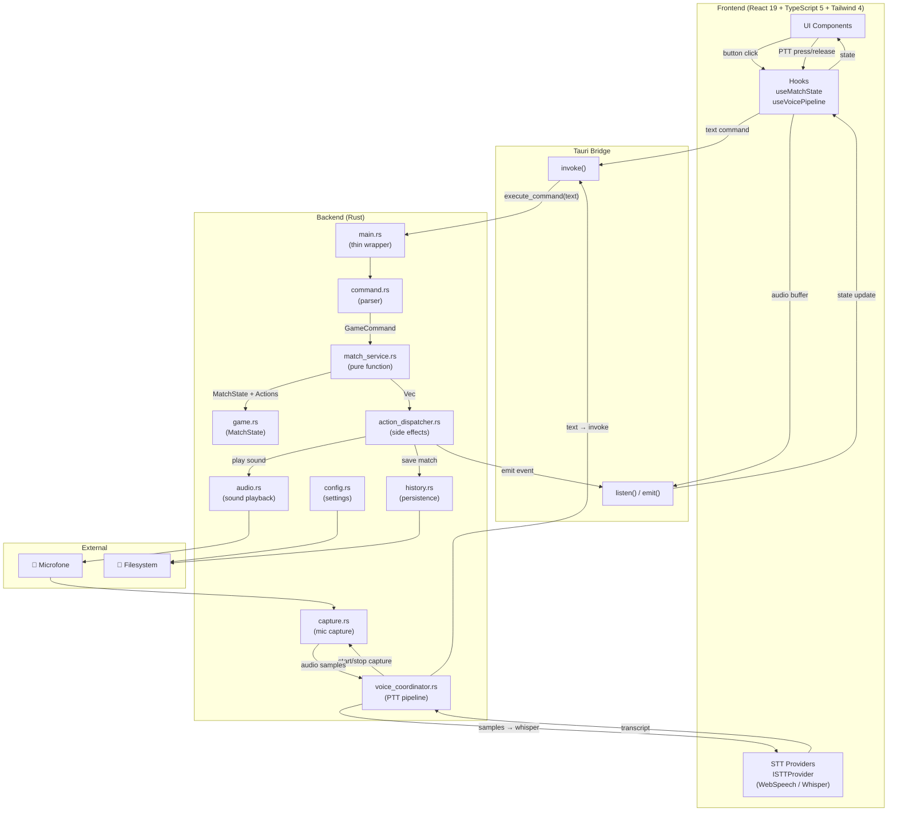
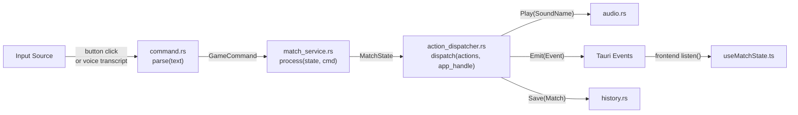
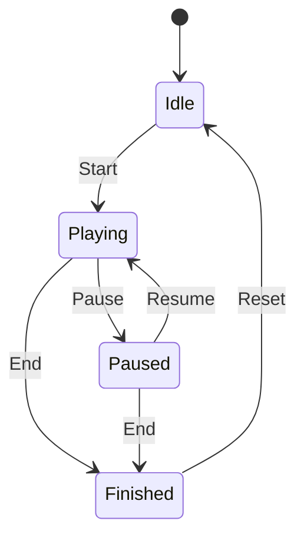
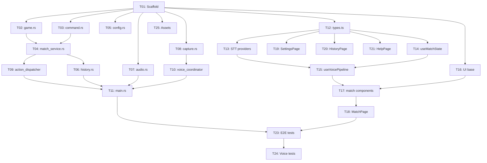

# E-Soccer Battle V5 — Arquitetura Simplificada

> **Versão:** 5.0.0  
> **Data:** 2026-03-31  
> **Autor:** Arquiteto Agent 🏛️  
> **Status:** FINAL — Pronto para implementação  
> **Base:** V3 (simplificada) — V4 descartada (comandos errados)

---

## Sumário

1. [Visão Geral](#1-visão-geral)
2. [Módulos Rust (Backend)](#2-módulos-rust-backend)
3. [Módulos TypeScript (Frontend)](#3-módulos-typescript-frontend)
4. [Contratos de Interface](#4-contratos-de-interface)
5. [ADRs](#5-adrs-architecture-decision-records)
6. [Tabela de Arquivos](#6-tabela-de-arquivos)
7. [Plano de Implementação (DAG)](#7-plano-de-implementação-dag)

---

## 1. Visão Geral

### 1.1 O que mudou do V3

| Item | V3 | V5 |
|------|-----|-----|
| PlayingSubPhase | Normal / Challenge | ❌ Removido |
| Comandos | 10 (Start, GoalA, GoalB, Pause, Resume, End, Reset, Doubt, Resolve, VoltaSeis) | 7 (Start, GoalA, GoalB, Pause, Resume, End, Reset) |
| "Dúvida" | Doubt → sub-phase Challenge | Pause simples |
| "Retornar" | Resolve/VoltaSeis → sub-phase Normal | Resume simples |
| "Volta 6" | VoltaSeis (6 metros) | Start (iniciar partida) |
| Sons | goal, whistle, six_meters, challenge | goal, whistle |
| Estados | Idle → Playing ↔ Challenge ↔ Paused → Finished → Idle | Idle → Playing ↔ Paused → Finished → Idle |

### 1.2 Comandos Confirmados

**Voz (5):**
| Comando | Mapeia para |
|---------|------------|
| "Volta 6" | `Start` |
| "Gol do time A" | `GoalA` |
| "Gol do time B" | `GoalB` |
| "Dúvida" | `Pause` |
| "Retornar" | `Resume` |

**Botão-only (2):**
| Botão | Mapeia para |
|-------|------------|
| Encerrar | `End` |
| Novo Jogo | `Reset` |

### 1.3 Diagrama de Arquitetura



### 1.4 Fluxo Unificado: Input → Parse → Process → Actions → Output



### 1.5 Máquina de Estados



**Simples. Quatro estados. Zero sub-fases.**

---

## 2. Módulos Rust (Backend)

### Estrutura de diretórios

```
src-tauri/src/
├── main.rs
├── game.rs
├── command.rs
├── match_service.rs
├── action_dispatcher.rs
├── voice_coordinator.rs
├── capture.rs
├── audio.rs
├── config.rs
└── history.rs
```

---

### 2.1 `game.rs` — Estado da Partida

**Responsabilidade ÚNICA:** Definir a estrutura de dados imutável que representa o estado de uma partida.

```rust
use serde::{Serialize, Deserialize};
use std::time::Duration;

/// Fase da partida — 4 estados, zero sub-fase
#[derive(Debug, Clone, Serialize, Deserialize, PartialEq)]
#[serde(rename_all = "snake_case")]
pub enum GamePhase {
    Idle,
    Playing,
    Paused,
    Finished,
}

/// Configuração da partida (imutável após início)
#[derive(Debug, Clone, Serialize, Deserialize)]
pub struct MatchConfig {
    pub team_a_name: String,
    pub team_b_name: String,
    pub duration_secs: u64,
    pub timer_mode: TimerMode,
}

#[derive(Debug, Clone, Serialize, Deserialize, PartialEq)]
#[serde(rename_all = "snake_case")]
pub enum TimerMode {
    Countdown,
    CountUp,
}

/// Estado completo e imutável da partida
#[derive(Debug, Clone, Serialize, Deserialize)]
pub struct MatchState {
    pub phase: GamePhase,
    pub config: MatchConfig,
    pub score_a: u32,
    pub score_b: u32,
    pub elapsed_secs: u64,
    pub started_at: Option<u64>,
    pub paused_elapsed_secs: u64,
    pub match_id: String,
}

impl MatchState {
    pub fn new(config: MatchConfig) -> Self;
    pub fn display_time(&self) -> Duration;
    pub fn is_time_up(&self) -> bool;
    pub fn with_score_a(self, score: u32) -> Self;
    pub fn with_score_b(self, score: u32) -> Self;
    pub fn with_phase(self, phase: GamePhase) -> Self;
    pub fn with_elapsed(self, elapsed: u64) -> Self;
}
```

**Depende de:** Nenhum (puro domain).  
**Dependências NÃO permitidas:** `tauri`, `cpal`, `rodio`.  
**Linhas estimadas:** ~90

---

### 2.2 `command.rs` — Parser de Comandos

**Responsabilidade ÚNICA:** Converter texto livre em `GameCommand` enumerado. Único ponto de parse.

```rust
use serde::{Serialize, Deserialize};

/// 7 comandos — simples e completo
#[derive(Debug, Clone, Serialize, Deserialize, PartialEq)]
#[serde(rename_all = "snake_case")]
pub enum GameCommand {
    Start,
    GoalA,
    GoalB,
    Pause,
    Resume,
    End,
    Reset,
}

#[derive(Debug, Clone, Serialize)]
pub struct ParseError {
    pub input: String,
    pub reason: String,
}

/// Parseia texto livre em GameCommand
/// "volta 6" / "volta seis" → Start
/// "gol a" / "gol do time a" / "goal a" → GoalA
/// "gol b" / "gol do time b" / "goal b" → GoalB
/// "dúvida" / "duvida" → Pause
/// "retornar" / "volta" / "continua" → Resume
/// "encerrar" / "terminar" → End
/// "novo jogo" / "reset" → Reset
pub fn parse(input: &str) -> Result<GameCommand, ParseError>;

/// Lista de comandos com aliases (help page)
pub fn available_commands() -> Vec<CommandHelp>;

#[derive(Debug, Clone, Serialize)]
pub struct CommandHelp {
    pub command: String,
    pub description: String,
    pub aliases: Vec<String>,
}
```

**Algoritmo:** normalize → lowercase → remove accents → keyword matching por prioridade.

**Depende de:** Nenhum.  
**Dependências NÃO permitidas:** `tauri`.  
**Linhas estimadas:** ~120

---

### 2.3 `match_service.rs` — Lógica de Negócio (PURO)

**Responsabilidade ÚNICA:** Receber estado + comando, retornar novo estado + ações. ZERO efeitos colaterais. ZERO dependência Tauri.

```rust
use crate::game::{MatchState, GamePhase};
use crate::command::GameCommand;

#[derive(Debug, Clone)]
pub enum Action {
    PlaySound(SoundName),
    EmitPhaseChanged(GamePhase),
    EmitScoreChanged { score_a: u32, score_b: u32 },
    EmitMatchFinished { score_a: u32, score_b: u32 },
    SaveMatch(MatchSnapshot),
    StartTimer,
    StopTimer,
    NoOp,
}

#[derive(Debug, Clone)]
pub enum SoundName {
    Goal,
    Whistle,
}

#[derive(Debug, Clone)]
pub struct MatchResult {
    pub new_state: MatchState,
    pub actions: Vec<Action>,
}

#[derive(Debug, Clone, serde::Serialize, serde::Deserialize)]
pub struct MatchSnapshot {
    pub match_id: String,
    pub team_a_name: String,
    pub team_b_name: String,
    pub score_a: u32,
    pub score_b: u32,
    pub duration_secs: u64,
    pub finished_at: String,
}

/// ÚNICA função pública. Pura. Determinística.
pub fn process(state: &MatchState, command: GameCommand) -> MatchResult;
```

#### Tabela de Transição (7 comandos × 4 fases)

| Command | Fase Permitida | Novo State | Ações |
|---------|---------------|------------|-------|
| `Start` | Idle | Playing, started_at=now | StartTimer, PlaySound(Whistle), EmitPhaseChanged |
| `GoalA` | Playing | score_a += 1 | PlaySound(Goal), EmitScoreChanged |
| `GoalB` | Playing | score_b += 1 | PlaySound(Goal), EmitScoreChanged |
| `Pause` | Playing | Paused | StopTimer, EmitPhaseChanged |
| `Resume` | Paused | Playing, recalc elapsed | StartTimer, EmitPhaseChanged |
| `End` | Playing, Paused | Finished | StopTimer, SaveMatch, PlaySound(Whistle), EmitMatchFinished |
| `Reset` | Finished | Idle (novo match_id) | EmitPhaseChanged |

**Qualquer comando em fase inválida** → `MatchResult { new_state: state.clone(), actions: vec![NoOp] }`

**Depende de:** `game`, `command`.  
**Dependências NÃO permitidas:** `tauri`, `cpal`, `rodio`, `std::fs`.  
**Linhas estimadas:** ~100

---

### 2.4 `action_dispatcher.rs` — Executor de Ações

**Responsabilidade ÚNICA:** Receber lista de `Action` e executar cada uma.

```rust
use tauri::{AppHandle, Emitter};
use crate::match_service::{Action, SoundName, MatchSnapshot};
use crate::audio;
use crate::history;

pub async fn dispatch(
    actions: Vec<Action>,
    app_handle: &AppHandle,
) -> Result<(), DispatchError>;

#[derive(Debug)]
pub enum DispatchError {
    Audio(String),
    History(String),
    Emit(String),
}
```

| Action | Execução |
|--------|----------|
| PlaySound(Goal) | `audio::play(SoundName::Goal).await` |
| PlaySound(Whistle) | `audio::play(SoundName::Whistle).await` |
| EmitPhaseChanged(p) | `app_handle.emit("phase-changed", p)` |
| EmitScoreChanged{..} | `app_handle.emit("score-changed", payload)` |
| EmitMatchFinished{..} | `app_handle.emit("match-finished", payload)` |
| SaveMatch(snap) | `history::save(snap).await` |
| StartTimer | `app_handle.emit("timer-control", "start")` |
| StopTimer | `app_handle.emit("timer-control", "stop")` |
| NoOp | skip |

**Depende de:** `match_service`, `audio`, `history`.  
**Linhas estimadas:** ~80

---

### 2.5 `voice_coordinator.rs` — Pipeline de Voz

**Responsabilidade ÚNICA:** Orquestrar PTT: captura → transcrição → envio para command pipeline.

```rust
use std::sync::mpsc;
use tauri::AppHandle;

pub enum VoiceEvent {
    TranscriptReady(String),
    Listening,
    Error(String),
}

pub struct VoiceCoordinator {
    is_listening: bool,
    event_tx: mpsc::Sender<VoiceEvent>,
}

impl VoiceCoordinator {
    pub fn new(event_tx: mpsc::Sender<VoiceEvent>) -> Self;
    pub async fn start_listening(&mut self, app: &AppHandle) -> Result<(), VoiceError>;
    pub async fn stop_listening(&mut self, app: &AppHandle) -> Result<(), VoiceError>;
    pub fn is_listening(&self) -> bool;
}

#[derive(Debug)]
pub enum VoiceError {
    Capture(String),
    Transcription(String),
    NotListening,
}
```

**Depende de:** `capture`.  
**Linhas estimadas:** ~110

---

### 2.6 `capture.rs` — Captura de Microfone

**Responsabilidade ÚNICA:** Capturar áudio do microfone via cpal.

```rust
use cpal::traits::{DeviceTrait, HostTrait, StreamTrait};

pub struct CaptureConfig {
    pub device_name: Option<String>,
    pub sample_rate: u32,
    pub channels: u16,
}

pub struct AudioBuffer {
    pub samples: Vec<f32>,
    pub sample_rate: u32,
    pub channels: u16,
}

pub struct CaptureStream {
    stream: cpal::Stream,
    buffer: Arc<Mutex<Vec<f32>>>,
    is_active: Arc<AtomicBool>,
}

impl CaptureStream {
    pub fn start(config: CaptureConfig) -> Result<Self, CaptureError>;
    pub fn stop(self) -> Result<AudioBuffer, CaptureError>;
    pub fn list_devices() -> Result<Vec<String>, CaptureError>;
}

#[derive(Debug)]
pub enum CaptureError {
    NoDevice,
    DeviceNotFound(String),
    StreamError(String),
    ConfigError(String),
}
```

**Depende de:** Nenhum.  
**Linhas estimadas:** ~140

---

### 2.7 `audio.rs` — Reprodução de Sons

**Responsabilidade ÚNICA:** Reproduzir arquivos de áudio. Apenas 2 sons: goal.wav, whistle.wav.

```rust
use std::path::PathBuf;

pub enum SoundFile {
    Goal,      // goal.wav
    Whistle,   // whistle.wav
}

impl SoundFile {
    pub fn filename(&self) -> &'static str;
}

pub async fn play(sound: SoundFile) -> Result<(), AudioError>;
pub fn preload_sounds(resource_path: PathBuf) -> Result<(), AudioError>;
pub fn volume() -> f32;
pub fn set_volume(vol: f32);

#[derive(Debug)]
pub enum AudioError {
    FileNotFound(String),
    Playback(String),
    Load(String),
}
```

**Sons em `src-tauri/sounds/`:** `goal.wav`, `whistle.wav`.

**Depende de:** Nenhum.  
**Linhas estimadas:** ~60

---

### 2.8 `config.rs` — Configurações Persistentes

**Responsabilidade ÚNICA:** Carregar/salvar configurações (JSON file).

```rust
use serde::{Serialize, Deserialize};

#[derive(Debug, Clone, Serialize, Deserialize)]
pub struct AppConfig {
    pub mic_device: Option<String>,
    pub whisper_model: WhisperModel,
    pub language: Language,
    pub voice_threshold: f32,
    pub team_a_name: String,
    pub team_b_name: String,
    pub theme: Theme,
    pub match_duration_secs: u64,
    pub timer_mode: TimerMode,
    pub volume: f32,
}

#[derive(Debug, Clone, Serialize, Deserialize, PartialEq)]
#[serde(rename_all = "lowercase")]
pub enum WhisperModel { Tiny, Base, Small }

#[derive(Debug, Clone, Serialize, Deserialize, PartialEq)]
#[serde(rename_all = "lowercase")]
pub enum Language { PtBr, En, Es }

#[derive(Debug, Clone, Serialize, Deserialize, PartialEq)]
#[serde(rename_all = "lowercase")]
pub enum Theme { Dark, Light }

#[derive(Debug, Clone, Serialize, Deserialize, PartialEq)]
#[serde(rename_all = "snake_case")]
pub enum TimerMode { Countdown, CountUp }

impl AppConfig {
    pub fn load() -> Result<Self, ConfigError>;
    pub fn save(&self) -> Result<(), ConfigError>;
    pub fn default() -> Self;
}

pub fn config_path() -> PathBuf;

#[derive(Debug)]
pub enum ConfigError { Io(String), Parse(String) }
```

**Path:** `{APP_DATA_DIR}/esoccer-battle/config.json`

**Depende de:** Nenhum.  
**Linhas estimadas:** ~100

---

### 2.9 `history.rs` — Persistência de Histórico

**Responsabilidade ÚNICA:** Salvar e listar histórico de partidas.

```rust
use crate::match_service::MatchSnapshot;
use serde::{Serialize, Deserialize};

#[derive(Debug, Clone, Serialize, Deserialize)]
pub struct HistoryEntry {
    pub id: String,
    pub match_id: String,
    pub team_a_name: String,
    pub team_b_name: String,
    pub score_a: u32,
    pub score_b: u32,
    pub duration_secs: u64,
    pub finished_at: String,
}

pub async fn save(snapshot: MatchSnapshot) -> Result<(), HistoryError>;
pub async fn list(limit: Option<usize>) -> Result<Vec<HistoryEntry>, HistoryError>;
pub async fn remove(id: &str) -> Result<(), HistoryError>;
pub async fn clear() -> Result<(), HistoryError>;

#[derive(Debug)]
pub enum HistoryError { Io(String), Parse(String) }
```

**Depende de:** `match_service` (MatchSnapshot).  
**Linhas estimadas:** ~80

---

### 2.10 `main.rs` — Thin Wrapper

**Responsabilidade ÚNICA:** Expor Tauri commands. ZERO lógica de negócio.

```rust
mod game;
mod command;
mod match_service;
mod action_dispatcher;
mod voice_coordinator;
mod capture;
mod audio;
mod history;
mod config;

use tauri::{AppHandle, Manager, State};
use std::sync::Mutex;
use game::MatchState;
use config::AppConfig;

struct AppState {
    match_state: Mutex<MatchState>,
    config: Mutex<AppConfig>,
}

#[tauri::command]
async fn execute_command(
    text: String,
    state: State<'_, AppState>,
    app: AppHandle,
) -> Result<serde_json::Value, String>;

#[tauri::command]
async fn start_listening(
    state: State<'_, AppState>,
    app: AppHandle,
) -> Result<(), String>;

#[tauri::command]
async fn stop_listening(
    state: State<'_, AppState>,
    app: AppHandle,
) -> Result<String, String>;

#[tauri::command]
async fn get_config(state: State<'_, AppState>) -> Result<AppConfig, String>;

#[tauri::command]
async fn update_config(new_config: AppConfig, state: State<'_, AppState>) -> Result<(), String>;

#[tauri::command]
async fn get_state(state: State<'_, AppState>) -> Result<MatchState, String>;

#[tauri::command]
async fn get_history(limit: Option<usize>) -> Result<Vec<history::HistoryEntry>, String>;

#[tauri::command]
async fn list_mic_devices() -> Result<Vec<String>, String>;

#[tauri::command]
async fn get_available_commands() -> Result<Vec<command::CommandHelp>, String>;

fn main() {
    tauri::Builder::default()
        .manage(AppState {
            match_state: Mutex::new(MatchState::new(config::AppConfig::default().into())),
            config: Mutex::new(config::AppConfig::default()),
        })
        .setup(|app| {
            audio::preload_sounds(app.path().resource_dir().unwrap_or_default()).ok();
            Ok(())
        })
        .invoke_handler(tauri::generate_handler![
            execute_command, start_listening, stop_listening,
            get_config, update_config, get_state, get_history,
            list_mic_devices, get_available_commands,
        ])
        .run(tauri::generate_context!())
        .expect("error while running tauri application");
}
```

**Exemplo `execute_command` (3 linhas de lógica):**
```rust
let cmd = command::parse(&text).map_err(|e| e.reason)?;
let current = state.match_state.lock().map_err(|e| e.to_string())?;
let result = match_service::process(&current, cmd);
action_dispatcher::dispatch(result.actions, &app).await.map_err(|e| format!("{:?}", e))?;
*state.match_state.lock().map_err(|e| e.to_string())? = result.new_state.clone();
Ok(serde_json::to_value(&result.new_state).unwrap_or_default())
```

**Note:** `reset_match` removido — `Reset` é apenas um `GameCommand` processado por `execute_command`.

**Depende de:** Todos os módulos.  
**Linhas estimadas:** ~80

---

## 3. Módulos TypeScript (Frontend)

### Estrutura de diretórios

```
src/
├── types.ts
├── hooks/
│   ├── useMatchState.ts
│   └── useVoicePipeline.ts
├── services/
│   └── stt/
│       ├── ISTTProvider.ts
│       ├── WebSpeechProvider.ts
│       ├── WhisperProvider.ts
│       └── sttFactory.ts
├── components/
│   ├── match/
│   │   ├── Scoreboard.tsx
│   │   ├── Timer.tsx
│   │   ├── Controls.tsx
│   │   ├── VoiceIndicator.tsx
│   │   ├── CommandLog.tsx
│   │   └── MatchLayout.tsx
│   ├── layout/
│   │   ├── Sidebar.tsx
│   │   └── AppShell.tsx
│   └── ui/
│       ├── Button.tsx
│       └── ThemeToggle.tsx
├── pages/
│   ├── MatchPage.tsx
│   ├── SettingsPage.tsx
│   ├── HistoryPage.tsx
│   └── HelpPage.tsx
├── App.tsx
└── main.tsx
```

---

### 3.1 `src/types.ts`

**Responsabilidade ÚNICA:** Tipos TypeScript espelhando backend. SEM `PlayingSubPhase`.

```typescript
// --- Enums (espelho Rust) ---
export type GamePhase = 'idle' | 'playing' | 'paused' | 'finished';
export type TimerMode = 'countdown' | 'countup';
export type WhisperModel = 'tiny' | 'base' | 'small';
export type Language = 'pt_br' | 'en' | 'es';
export type Theme = 'dark' | 'light';

// --- State ---
export interface MatchConfig {
  team_a_name: string;
  team_b_name: string;
  duration_secs: number;
  timer_mode: TimerMode;
}

export interface MatchState {
  phase: GamePhase;
  config: MatchConfig;
  score_a: number;
  score_b: number;
  elapsed_secs: number;
  started_at: number | null;
  paused_elapsed_secs: number;
  match_id: string;
}

export interface AppConfig {
  mic_device: string | null;
  whisper_model: WhisperModel;
  language: Language;
  voice_threshold: number;
  team_a_name: string;
  team_b_name: string;
  theme: Theme;
  match_duration_secs: number;
  timer_mode: TimerMode;
  volume: number;
}

// --- History ---
export interface HistoryEntry {
  id: string;
  match_id: string;
  team_a_name: string;
  team_b_name: string;
  score_a: number;
  score_b: number;
  duration_secs: number;
  finished_at: string;
}

// --- Commands ---
export interface CommandHelp {
  command: string;
  description: string;
  aliases: string[];
}

// --- Voice ---
export type VoiceStatus = 'idle' | 'listening' | 'processing' | 'error';

export interface VoiceEvent {
  status: VoiceStatus;
  transcript?: string;
  error?: string;
}

// --- Event Payloads ---
export interface ScoreChangedPayload { score_a: number; score_b: number; }
export interface MatchFinishedPayload { score_a: number; score_b: number; }
```

**Linhas estimadas:** ~80

---

### 3.2 `src/hooks/useMatchState.ts`

**Responsabilidade ÚNICA:** Sincronizar estado da partida via Tauri events + timer local.

```typescript
interface UseMatchStateReturn {
  state: MatchState | null;
  config: AppConfig | null;
  isLoading: boolean;
  displayTime: string;
  executeCommand: (text: string) => Promise<void>;
  loadConfig: () => Promise<void>;
  updateConfig: (config: AppConfig) => Promise<void>;
}

export function useMatchState(): UseMatchStateReturn;
```

- Mount: `invoke('get_state')` + `invoke('get_config')`
- Listen: `phase-changed`, `score-changed`, `match-finished`, `timer-control`
- Timer local via `setInterval(1000)` quando phase=playing

**Linhas estimadas:** ~100

---

### 3.3 `src/hooks/useVoicePipeline.ts`

**Responsabilidade ÚNICA:** PTT → ISTTProvider → execute_command. DIP.

```typescript
interface UseVoicePipelineReturn {
  voiceStatus: VoiceStatus;
  isListening: boolean;
  lastTranscript: string | null;
  lastError: string | null;
  startListening: () => Promise<void>;
  stopListening: () => Promise<void>;
  cancelListening: () => void;
  setProvider: (provider: ISTTProvider) => void;
}

interface UseVoicePipelineOptions {
  provider: ISTTProvider;
  onTranscript: (text: string) => Promise<void>;
  onError?: (error: string) => void;
}

export function useVoicePipeline(options: UseVoicePipelineOptions): UseVoicePipelineReturn;
```

**NÃO depende de:** WebSpeechProvider, WhisperProvider (DIP).  
**Linhas estimadas:** ~80

---

### 3.4 `src/services/stt/ISTTProvider.ts`

```typescript
export interface ISTTProvider {
  readonly name: string;
  start(): Promise<void>;
  stop(): Promise<string>;
  cancel(): void;
  isAvailable(): Promise<boolean>;
  onStatusChange?: (status: 'idle' | 'listening' | 'processing') => void;
}
```

**Linhas estimadas:** ~15

---

### 3.5 `src/services/stt/WebSpeechProvider.ts`

```typescript
export class WebSpeechProvider implements ISTTProvider {
  readonly name = 'web-speech';
  constructor(lang: string = 'pt-BR');
  async start(): Promise<void>;
  async stop(): Promise<string>;
  cancel(): void;
  async isAvailable(): Promise<boolean>;
  onStatusChange?: (status: 'idle' | 'listening' | 'processing') => void;
}
```

**Linhas estimadas:** ~70

---

### 3.6 `src/services/stt/WhisperProvider.ts`

```typescript
export class WhisperProvider implements ISTTProvider {
  readonly name = 'whisper';
  constructor(model: string = 'base', language: string = 'pt-BR');
  async start(): Promise<void>;  // invoke('start_listening')
  async stop(): Promise<string>; // invoke('stop_listening')
  cancel(): void;
  async isAvailable(): Promise<boolean>;
  onStatusChange?: (status: 'idle' | 'listening' | 'processing') => void;
}
```

**Linhas estimadas:** ~50

---

### 3.7 `src/services/stt/sttFactory.ts`

```typescript
export type STTBackend = 'auto' | 'web-speech' | 'whisper';
export async function createSTTProvider(backend: STTBackend, config: AppConfig): Promise<ISTTProvider>;
```

**Linhas estimadas:** ~25

---

### 3.8–3.13 Componentes match/

| Componente | Props | Responsabilidade | Linhas |
|---|---|---|---|
| `Scoreboard.tsx` | teamA/B Name, scoreA/B, phase | Placar com destaque no gol | ~50 |
| `Timer.tsx` | displayTime, phase, timerMode, duration | Cronômetro + progress bar | ~40 |
| `Controls.tsx` | phase, onExecuteCommand | Botões: Iniciar (voz), Gol A, Gol B, Encerrar, Novo Jogo | ~70 |
| `VoiceIndicator.tsx` | status, lastTranscript, isListening, onStart/Stop | Botão PTT + indicador visual | ~60 |
| `CommandLog.tsx` | entries: CommandLogEntry[] | Log scrollável de comandos | ~40 |
| `MatchLayout.tsx` | — | Orquestra componentes match/* | ~30 |

**Note:** `Controls.tsx` NÃO tem botões "Dúvida" nem "Retornar" — esses são voz-only. Apenas: **Encerrar** e **Novo Jogo** como botões.

---

### 3.14–3.17 Páginas

| Página | Responsabilidade | Linhas |
|---|---|---|
| `MatchPage.tsx` | Principal: useMatchState + useVoicePipeline + MatchLayout | ~40 |
| `SettingsPage.tsx` | Formulário de config | ~140 |
| `HistoryPage.tsx` | Tabela de partidas anteriores | ~70 |
| `HelpPage.tsx` | Lista comandos de voz + aliases | ~50 |

---

### 3.18–3.19 App Shell

| Arquivo | Responsabilidade | Linhas |
|---|---|---|
| `App.tsx` | Router com 4 páginas + AppShell | ~25 |
| `main.tsx` | Entry point React | ~10 |
| `Sidebar.tsx` | Navegação lateral | ~25 |
| `AppShell.tsx` | Shell layout | ~15 |
| `Button.tsx` | Botão reutilizável | ~25 |
| `ThemeToggle.tsx` | Toggle dark/light | ~15 |

---

## 4. Contratos de Interface

### 4.1 Tauri Events

| Event Name | Payload | Emissor | Consumidor |
|---|---|---|---|
| `phase-changed` | `GamePhase` | action_dispatcher | useMatchState |
| `score-changed` | `{ score_a, score_b }` | action_dispatcher | useMatchState |
| `match-finished` | `{ score_a, score_b }` | action_dispatcher | useMatchState |
| `timer-control` | `"start" \| "stop"` | action_dispatcher | useMatchState |
| `voice-status` | `{ status, transcript?, error? }` | voice_coordinator | useVoicePipeline |

### 4.2 Tauri Commands

| Command | Parâmetros | Retorno | Descrição |
|---|---|---|---|
| `execute_command` | `text: String` | `MatchState (JSON)` | Parseia + executa qualquer comando |
| `start_listening` | — | `()` | Inicia captura PTT |
| `stop_listening` | — | `String` (transcript) | Para captura, transcreve |
| `get_config` | — | `AppConfig` | Config atual |
| `update_config` | `AppConfig` | `()` | Salva config |
| `get_state` | — | `MatchState` | Estado da partida |
| `get_history` | `limit?: usize` | `Vec<HistoryEntry>` | Histórico |
| `list_mic_devices` | — | `Vec<String>` | Dispositivos de áudio |
| `get_available_commands` | — | `Vec<CommandHelp>` | Comandos de voz |

**Total: 9 commands** (1 a menos que V3 — `reset_match` removido, Reset vai por `execute_command`).

### 4.3 Interface ISTTProvider

```typescript
interface ISTTProvider {
  readonly name: string;
  start(): Promise<void>;
  stop(): Promise<string>;
  cancel(): void;
  isAvailable(): Promise<boolean>;
  onStatusChange?: (status: 'idle' | 'listening' | 'processing') => void;
}
```

---

## 5. ADRs (Architecture Decision Records)

### ADR-001: MatchService como Função Pura

**Status:** Herdado do V3 ✅  
**Contexto:** Processar comandos e produzir mudanças de estado + ações.  
**Decisão:** `match_service::process(state, cmd) → MatchResult` é pura, sem efeitos colaterais.  
**Consequências:** Testável sem mock, determinística, separada de infraestrutura.

---

### ADR-002: Unificação Voice e UI

**Status:** Herdado do V3 ✅  
**Contexto:** V4 teve duplicação voice/UI.  
**Decisão:** Ambos convergem em `command::parse(text)`. V5 reforça: "Volta 6", "Dúvida", "Retornar" são comandos de voz que mapeiam para `Start`, `Pause`, `Resume`.  
**Consequências:** Zero duplicação. Novo comando = funciona em ambos.

---

### ADR-003: ISTTProvider Interface (DIP)

**Status:** Herdado do V3 ✅  
**Decisão:** Interface `ISTTProvider` com factory. Frontend referencia interface, nunca implementação.  
**Consequências:** WebSpeech e Whisper intercambiáveis, testável com mock.

---

### ADR-004: Action Dispatcher Separado

**Status:** Herdado do V3 ✅  
**Decisão:** `action_dispatcher.rs` é o ÚNICO módulo com efeitos colaterais.  
**Consequências:** SRP respeitado. match_service = lógica, dispatcher = efeitos.

---

### ADR-005: State Management via Tauri Events

**Status:** Herdado do V3 ✅  
**Decisão:** Backend emite eventos, frontend escuta. Single source of truth = Rust.  
**Consequências:** Frontend é view-only, push-based, sem polling.

---

### ADR-006: Config como JSON File

**Status:** Herdado do V3 ✅  
**Decisão:** `{APP_DATA_DIR}/esoccer-battle/config.json`.  
**Consequências:** Zero dependência extra, leitura humana.

---

### ADR-007: Timer no Frontend

**Status:** Herdado do V3 ✅  
**Decisão:** Backend emite `timer-control: start/stop`. Frontend roda `setInterval(1000)`.  
**Consequências:** Backend sem thread de timer, drift aceitável para futebol society.

---

### ADR-008: Máquina de Estados Simplificada (V5 novo)

**Status:** Novo ✅  
**Contexto:** V3 tinha PlayingSubPhase (Normal/Challenge) para modo "dúvida". V4 implementou errado.  
**Decisão:** V5 remove PlayingSubPhase. "Dúvida" = Pause simples. "Retornar" = Resume simples. 4 estados apenas.  
**Consequências:**
- ✅ Dramaticamente mais simples
- ✅ Impossible to have "stuck in challenge" bugs
- ✅ match_service tabela cai de 10→7 comandos
- ⚠️ Sem modo 6 metros (aceitável — não era usado)

---

## 6. Tabela de Arquivos

### Rust (Backend)

| # | Arquivo | Responsabilidade | Depende de | Linhas |
|---|---------|------------------|------------|--------|
| 1 | `src-tauri/src/game.rs` | Estado da partida | Nenhum | ~90 |
| 2 | `src-tauri/src/command.rs` | Parser de comandos (7) | Nenhum | ~120 |
| 3 | `src-tauri/src/match_service.rs` | Lógica pura process() | game, command | ~100 |
| 4 | `src-tauri/src/action_dispatcher.rs` | Executor de ações | match_service, audio, history | ~80 |
| 5 | `src-tauri/src/voice_coordinator.rs` | Pipeline PTT | capture | ~110 |
| 6 | `src-tauri/src/capture.rs` | Captura microfone | Nenhum | ~140 |
| 7 | `src-tauri/src/audio.rs` | Reprodução sons (2) | Nenhum | ~60 |
| 8 | `src-tauri/src/config.rs` | Config JSON | Nenhum | ~100 |
| 9 | `src-tauri/src/history.rs` | Histórico partidas | match_service | ~80 |
| 10 | `src-tauri/src/main.rs` | Tauri commands (thin) | Todos | ~80 |

**Subtotal Rust: ~960 linhas**

### TypeScript (Frontend)

| # | Arquivo | Responsabilidade | Linhas |
|---|---------|------------------|--------|
| 11 | `src/types.ts` | Tipos compartilhados | ~80 |
| 12 | `src/hooks/useMatchState.ts` | Estado + timer | ~100 |
| 13 | `src/hooks/useVoicePipeline.ts` | Pipeline PTT | ~80 |
| 14 | `src/services/stt/ISTTProvider.ts` | Interface STT | ~15 |
| 15 | `src/services/stt/WebSpeechProvider.ts` | Web Speech API | ~70 |
| 16 | `src/services/stt/WhisperProvider.ts` | Whisper via Tauri | ~50 |
| 17 | `src/services/stt/sttFactory.ts` | Factory provider | ~25 |
| 18 | `src/components/match/Scoreboard.tsx` | Placar | ~50 |
| 19 | `src/components/match/Timer.tsx` | Cronômetro | ~40 |
| 20 | `src/components/match/Controls.tsx` | Botões | ~70 |
| 21 | `src/components/match/VoiceIndicator.tsx` | PTT button | ~60 |
| 22 | `src/components/match/CommandLog.tsx` | Log comandos | ~40 |
| 23 | `src/components/match/MatchLayout.tsx` | Layout partida | ~30 |
| 24 | `src/components/layout/Sidebar.tsx` | Navegação | ~25 |
| 25 | `src/components/layout/AppShell.tsx` | Shell | ~15 |
| 26 | `src/components/ui/Button.tsx` | Botão reutilizável | ~25 |
| 27 | `src/components/ui/ThemeToggle.tsx` | Toggle tema | ~15 |
| 28 | `src/pages/MatchPage.tsx` | Página principal | ~40 |
| 29 | `src/pages/SettingsPage.tsx` | Configurações | ~140 |
| 30 | `src/pages/HistoryPage.tsx` | Histórico | ~70 |
| 31 | `src/pages/HelpPage.tsx` | Ajuda comandos | ~50 |
| 32 | `src/App.tsx` | Router + layout | ~25 |
| 33 | `src/main.tsx` | Entry point | ~10 |

**Subtotal TypeScript: ~1,215 linhas**

### Assets & Config

| # | Arquivo | Descrição |
|---|---------|-----------|
| 34 | `src-tauri/sounds/goal.wav` | Som de gol |
| 35 | `src-tauri/sounds/whistle.wav` | Som de apito |
| 36 | `src-tauri/Cargo.toml` | Dependências Rust |
| 37 | `src-tauri/tauri.conf.json` | Config Tauri |
| 38 | `package.json` | Deps frontend |
| 39 | `vite.config.ts` | Config Vite |
| 40 | `tailwind.config.ts` | Config Tailwind |

### Resumo

| Métrica | V3 | V5 | Δ |
|---------|-----|-----|---|
| Arquivos de código | 33 | 33 | 0 |
| Linhas Rust | ~1,200 | ~960 | -20% |
| Linhas TypeScript | ~1,440 | ~1,215 | -16% |
| **Linhas totais** | **~2,640** | **~2,175** | **-18%** |
| GameCommands | 10 | 7 | -30% |
| GamePhases | 4 (+ sub) | 4 | Simplificado |
| SoundFiles | 4 | 2 | -50% |
| Tauri Commands | 10 | 9 | -1 |
| ADRs | 7 | 8 | +1 (V5 simplificação) |

---

## 7. Plano de Implementação (DAG)

### Diagrama



### Tasks

| ID | Tipo | Agente | Descrição | Depende de |
|----|------|--------|-----------|------------|
| T01 | scaffold | builder | Criar projeto Tauri v2 + React 19 + Vite 6 + TS 5 + Tailwind 4. Cargo.toml com deps (cpal, whisper-rs, rodio, serde, chrono, uuid). | — |
| T02 | impl | backend-agent | game.rs — MatchState, GamePhase (4), MatchConfig, TimerMode. SEM PlayingSubPhase. | T01 |
| T02-T | test | qa-tester | Testes game.rs: new(), with_*, display_time, is_time_up, serialization. | T02 |
| T03 | impl | backend-agent | command.rs — GameCommand (7), parse() com aliases, CommandHelp. "Volta 6"→Start, "Dúvida"→Pause, "Retornar"→Resume. | T01 |
| T03-T | test | qa-tester | Testes command.rs: parse para todos 7 comandos + variações. | T03 |
| T04 | impl | backend-agent | match_service.rs — Action (7 tipos), SoundName (2), process() com tabela 7×4. | T02, T03 |
| T04-T | test | qa-tester | Testes match_service: TODOS 7 comandos em TODAS 4 fases (válidas + inválidas). | T04 |
| T05 | impl | backend-agent | config.rs — AppConfig, load/save JSON, default(). | T01 |
| T06 | impl | backend-agent | history.rs — save/list/remove/clear. | T04 |
| T07 | impl | backend-agent | audio.rs — SoundFile (Goal, Whistle), play(), preload_sounds(). | T01 |
| T08 | impl | backend-agent | capture.rs — CaptureStream via cpal. | T01 |
| T09 | impl | backend-agent | action_dispatcher.rs — dispatch() mapeando Actions. | T04, T05, T06, T07 |
| T10 | impl | backend-agent | voice_coordinator.rs — PTT pipeline. | T08 |
| T11 | impl | backend-agent | main.rs — AppState, 9 Tauri commands (thin). Setup preload_sounds. | T02-T, T03-T, T04-T, T09, T10 |
| T11-R | review | code-review | Review backend: SOLID, thin main.rs, match_service puro. Min score 80. | T11 |
| T12 | impl | frontend-agent | types.ts — Tipos espelhando backend. SEM PlayingSubPhase. | T01 |
| T13 | impl | frontend-agent | STT: ISTTProvider + WebSpeech + Whisper + sttFactory. | T12 |
| T14 | impl | frontend-agent | useMatchState.ts — Estado + timer local. | T12 |
| T15 | impl | frontend-agent | useVoicePipeline.ts — PTT via ISTTProvider (DIP). | T13, T14 |
| T16 | impl | frontend-agent | UI base: Button, ThemeToggle, Sidebar, AppShell. | T12 |
| T17 | impl | frontend-agent | Components match/: Scoreboard, Timer, Controls, VoiceIndicator, CommandLog, MatchLayout. Controls SEM botões Dúvida/Retornar. | T15, T16 |
| T18 | impl | frontend-agent | MatchPage.tsx — Orquestra hooks + layout + STT factory. | T17 |
| T19 | impl | frontend-agent | SettingsPage.tsx — Formulário config. | T12, T16 |
| T20 | impl | frontend-agent | HistoryPage.tsx — Tabela partidas. | T12, T16 |
| T21 | impl | frontend-agent | HelpPage.tsx — Comandos voz + aliases. | T12, T16 |
| T22 | impl | frontend-agent | App.tsx (router) + main.tsx. | T18, T19, T20, T21 |
| T22-R | review | code-review | Review frontend: DIP, SOLID, KISS. Min score 80. | T22 |
| T23 | integration | qa-tester | E2E: iniciar → gol A → gol B → pausar → retomar → encerrar → novo jogo. | T11, T22 |
| T24 | integration | qa-tester | Teste voz: PTT → transcrição → parse → execução. | T23 |
| T25 | asset | builder | Assets: goal.wav, whistle.wav, ícone app. | T01 |

### Ordem de Execução (Timeline)

```
Fase 1 (paralelo):  T01 → {T02, T03, T05, T07, T08, T12, T16, T25}
Fase 2 (paralelo):  {T02-T, T03-T, T04, T13, T19, T20, T21}
Fase 3 (paralelo):  {T04-T, T06, T14}
Fase 4 (paralelo):  {T09, T10, T15}
Fase 5:             T11 → T11-R
Fase 6:             T17 → T18
Fase 7:             T22 → T22-R
Fase 8:             T23 → T24
```

---

## Anexo: Verificação Anti-Bugs

| Risco | Regra | Garantia |
|-------|-------|----------|
| Duplicação voice/UI | ADR-002 | `command.rs` é único ponto de parse |
| Voice desconectada | ADR-002 + main.rs | `stop_listening` → transcript → `execute_command` |
| Frontend acoplado impl STT | ADR-003 | `useVoicePipeline` aceita `ISTTProvider` |
| main.rs com lógica | Regra hard | Cada command = 3-5 linhas |
| Sub-fase bug | ADR-008 | Zero PlayingSubPhase no código |
| Comandos errados | Tabela V5 | "Volta 6"=Start, "Dúvida"=Pause, "Retornar"=Resume |

---

> 🏛️ **Documento pronto para implementação.**  
> **33 arquivos de código, ~2,175 linhas totais.**  
> Backend: começar por game.rs, command.rs, config.rs (sem deps).  
> Frontend: começar por types.ts e ISTTProvider.
